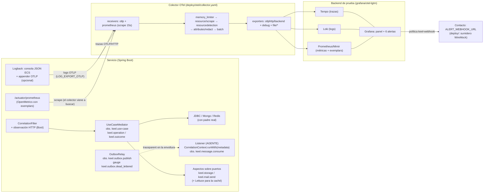

# Observabilidad del proyecto generado: arquitectura, garantías y fragilidades

> **No confundir con `OBSERVABILIDAD.md`.** Aquel es la **guía de uso y operación** para personas
> (activar, mirar, diagnosticar, llevar a producción); es copia byte a byte de
> `packages/keel-spring/assets/generators/spring/observabilidad.md`, se instala en cada proyecto
> generado como `docs/keel/observabilidad.md` y un test (`test/observability-doc.test.js`) vigila
> que las dos copias no diverjan. **Este** documento es para quien mantiene el generador: explica
> cómo encajan las piezas, qué garantiza cada una y dónde puede fallar sin que nadie lo note.

Cómo funciona, pieza a pieza, la observabilidad de un servicio generado con
`keel-spring build --telemetry otel`: qué hace cada pieza, qué papel cumple en el conjunto,
quién la produce, qué la verifica y qué pasa cuando falla. El objetivo es entender el sistema
entero con detalle suficiente para **proponer cómo robustecerlo**; las propuestas están al final
(§6), cada una ligada a una fragilidad concreta de §5.

> **Cómo leer las afirmaciones.** Cada una lleva su origen:
> **[código]** leído en el generador, con `archivo:línea` relativo a `packages/keel-spring/`;
> **[generado]** leído en la salida real de `build` (fixtures `catalog-extended` y
> `notification-mailer` generados con `telemetry: otel` el 2026-09-22);
> **[reglas]** tomado de `.claude/rules/spring-telemetria.md` sin volver a ejecutarlo;
> **[guía]** tomado de `OBSERVABILIDAD.md` (sobre todo §11, «Qué de esta guía está medido»),
> sin volver a ejecutarlo;
> **[inferido]** deducido del código pero **no medido**: hay que confirmarlo antes de actuar.
>
> Este documento es de este repo, no payload: no se siembra en ningún proyecto. El razonamiento
> de cada decisión de detalle vive en `.claude/rules/spring-telemetria.md`; aquí se cuenta cómo
> encajan.

---

## 1. Propósito y alcance

La pregunta que responde: **cuando un servicio generado está en marcha, ¿qué señales emite,
por dónde viajan, dónde se miran, quién avisa cuando algo va mal, y cuánto de eso está
garantizado por el generador frente a lo que depende del agente, de Spring Boot o de quien
despliega?**

Alcance y condiciones:

- **La telemetría es una elección de stack, no del DSL.** Solo existe con `telemetry: otel` en
  `keel-stack.json` (o `--telemetry otel`); el valor por defecto es `none`
  (`src/lib/stack-catalog.js:1043`) **[código]**. Ninguna capa del diseño la pide, así que el
  mismo diseño puede generarse con o sin ella.
- **Sin telemetría quedan tres cosas**, porque se generan igual: la **correlación**
  (`X-Correlation-Id` en HTTP, `metadata.correlationId` en los eventos), los **logs de frontera**
  (inicio y fin de caso de uso, duplicado descartado, evento publicado) y el gauge
  `keel.outbox.dead_lettered` **[reglas]**.
- `infra/` (la infraestructura de la generación) **no** lleva telemetría: no hay escenarios `FL-*`
  de observabilidad, y en el perfil `local` la exportación va apagada por defecto
  (`TELEMETRY_EXPORT_ENABLED:false`) **[generado]**. Todo el recorrido completo existe **solo en
  `deploy/`** y, en producción, en las plantillas de referencia.

---

## 2. Mapa de punta a punta

Quién produce cada tramo:

| Tramo | Lo produce | Determinista en `build` |
|---|---|---|
| Correlación, observación del caso de uso, relay, aspectos, `TelemetryConfig` | `build` | sí |
| Continuación de la traza en el **listener** | **el agente** (una línea por listener) | no; lo vigila un gate de presencia |
| Observación HTTP, JDBC, exemplars, series de JVM y del pool | **Spring Boot** y sus librerías, por autoconfiguración | la dependencia sí; el comportamiento, lo decide Boot |
| Colector, backend, panel, alertas, contacto de `deploy/` | `build` | sí |
| Colectores de producción (agent + gateway) | `build`, como **plantilla para Kubernetes**; en otra plataforma, la adapta quien despliega | sí, pero **sin red repetible** que los ejecute |
| Destino real de las alertas, muestreo, qué se expone en producción | **quien despliega**, por variables de entorno | no |

Determinismo, verificado: en los módulos de telemetría, panel, logging y `deploy/` no hay
`Date`, `Math.random` ni `randomUUID` que hagan variar la salida entre dos builds; el único
`randomUUID` es código Java que se ejecuta en runtime (`src/scaffold/correlation.js:158`). El uid
del panel se deriva del proyecto (`keel-<artifactId>`, `src/scaffold/observability-assets.js:243`)
**[código]**.

---

## 3. Las piezas

Cada pieza sigue la misma ficha: **qué hace · función en el conjunto · quién la produce · de qué
deriva · qué la verifica · qué pasa si falla**.

### 3.1 El vocabulario único (`src/lib/telemetry-probes.js`) y el catálogo de infraestructura

- **Qué hace.** Define los nombres de todo lo que el servicio emite: observaciones
  (`keel.use-case`, `keel.outbox.publish`, `keel.message.consume`, `keel.storage`,
  `keel.mail.send`, líneas 35-41), atributos (`keel.operation`, `keel.outcome`,
  `keel.event.type`, `keel.correlation_id`, `keel.storage.operation`, `keel.storage.bucket`,
  líneas 58-65), interruptores por entorno (líneas 79-98), el transporte de métricas (líneas
  125-130), las series del runtime (líneas 147-207) y la del retraso del consumidor por broker
  (líneas 222-247). `promMetric()` (línea 261) traduce un nombre de observación al de su serie en
  Prometheus: puntos y guiones a `_` y la unidad **en segundos** **[código]**.
- **Función.** Es la **pieza que ata todo**: de aquí renderizan el Java (`telemetry.js`), la
  configuración (`config.js`), el panel y las alertas (`observability-assets.js`) y las sondas
  en vivo (`telemetry-check`, `deploy-check`). Existe porque el modo de fallo típico de la
  observabilidad es silencioso: un panel que consulta un nombre que nadie publica **no falla, se
  queda vacío**, y una alerta sobre una serie inexistente **no dispara nunca** (comentario de
  las líneas 12-17).
- **Catálogo** (`src/lib/stack-catalog.js:936-1039`): `TELEMETRY` (la opción de stack),
  `TELEMETRY_INFRA` (imagen y puertos del colector, backend de prueba y la **única** variable que
  lee la app, `OTEL_EXPORTER_OTLP_ENDPOINT`), `ALERTING` (contacto, variable
  `ALERT_WEBHOOK_URL`, sumidero) y `GRAFANA_PROVISIONING` (rutas de dentro del contenedor, que
  aparecen en dos sitios) **[código]**.
- **Verificación.** `test/telemetry-probes.test.js` y `test/observability-assets.test.js` cruzan
  cada serie que consulta el panel contra las que el servidor publica **según el vocabulario**
  (es decir, el vocabulario contra sí mismo). Lo que lo compara contra el **servidor real** es
  `telemetry-check` (§3.13).
- **Si falla.** Un nombre mal puesto aquí se propaga a todos los consumidores **a la vez**, así
  que no produce incoherencia interna: produce un panel vacío y alertas mudas. Solo lo destapa una
  red en vivo.

### 3.2 Trazas

**Qué hace y quién la produce.**

| Span / observación | Lo abre | Dónde |
|---|---|---|
| Petición HTTP entrante | Spring Boot (`http.server.requests`) | autoconfiguración |
| Caso de uso | `UseCaseMediator` generado: `keel.use-case` con `keel.operation` y `keel.outcome = ok \| rejected \| error` | `src/scaffold/mediator.js:244-337` **[código]** |
| SQL / Mongo / Redis | JDBC (`datasource-micrometer`), `MongoObservationCommandListener`, Lettuce | Boot + `TelemetryConfig`, `CacheObservationConfig` |
| Llamada HTTP saliente | cliente instrumentado (`http.client.requests`) | `http-clients.js` |
| Publicación desde el outbox | `OutboxRelay`: `MessageTracing.continueFrom(traceparent de la fila, keel.outbox.publish, PRODUCER)` | `src/scaffold/outbox.js`, `telemetry.js:86` **[código]** |
| Consumo de un mensaje | `CorrelationContext.runWith(metadata, …)` → `continueFrom(metadata.traceparent, keel.message.consume, CONSUMER)` | **listener del agente** + `correlation.js:54` |
| Storage / correo | aspectos `@Around` sobre el **puerto** | `telemetry.js:289`, `:326` |

**La propagación a través de los eventos** es la parte más delicada. El `traceparent` W3C viaja
en `metadata.traceparent` **de la envoltura keel**, que es contrato público del evento: lo estampa
`EventEnvelope.of(...)` al publicar (con `MessageTracing.currentTraceparent()`) y lo restaura el
listener al consumir **[generado]**. Va en el sobre, y no solo en las cabeceras del broker, por
dos razones que da el javadoc de `MessageTracing`: con `reliability: outbox` la publicación
ocurre en otro hilo y en otro instante (el contexto de la petición ya no existe y solo lo conserva
la fila), y SNS/SQS no tiene propagación nativa en Spring Cloud AWS. Con Kafka y RabbitMQ la
cabecera nativa se propaga además (`spring.kafka.template/listener.observation-enabled: true`
en `telemetry.yaml`) **[generado]**.

**El predicado anti-ruido** (`TelemetryConfig.ignoreBackgroundNoise`, `telemetry.js:253`) es
«la mitad de la robustez» según su propio comentario: descarta `tasks.scheduled.execution` y las
consultas a almacenes **sin padre real**. Sin él, el relay (que corre cada segundo) generaría una
traza raíz por tick. El detalle que costó una medición: un padre *no-op* no cuenta como padre
(`hasRealParent`), porque el tick descartado queda como observación actual en forma de no-op
**[generado]**. Otro predicado (`ignoreActuator`) descarta las probes de `/actuator`.

**El `correlationId` en los spans** (`correlationIdOnSpans`, `telemetry.js:150`): atributo de
alta cardinalidad `keel.correlation_id` en el span HTTP (leído de la cabecera de la respuesta,
porque el filtro ya limpió su contexto) y en el del caso de uso. Sirve para encontrar una traza
por el id que recibió el cliente **[generado]**.

- **Función.** Las trazas son el hilo que une una petición con todo lo que provoca, incluidos
  los eventos que salen y los consumos que llegan a otros servicios. Son también el destino del
  salto desde una métrica (vía exemplar) y desde un log (vía `trace.id`).
- **Verificación.** Hay tres comprobaciones automáticas («redes») que miran las trazas, de menos a
  más realistas (detalle completo en §3.13) **[código]**:

  | Red | Qué hace | Qué demuestra |
  |---|---|---|
  | `test/telemetry.test.js` (21 pruebas) | Genera un proyecto y **busca texto** en los archivos generados | Que el generador escribe lo esperado. No ejecuta nada: un código que compila pero no funciona pasaría |
  | `telemetry-check` | **Arranca el servicio** bajo JUnit en la máquina y llama directamente a sus piezas internas (los puertos y el mediator) | Que el servicio en marcha **produce** las trazas y métricas correctas. No mira si llegan a ningún sitio |
  | `deploy-check` | **Levanta `deploy/` entero** en contenedores, manda peticiones y **pregunta al backend** qué recibió | Que el recorrido completo funciona de punta a punta |

  `deploy-check` ejecuta ocho comprobaciones, **DEP-1 a DEP-8**, definidas en
  `scripts/deploy-check.js`. Las dos que tocan a las trazas son **DEP-3**, que exige que la
  métrica de latencia llegue al Prometheus del backend con un **exemplar** (el enlace a una traza),
  y **DEP-4**, que exige que esa traza **exista de verdad en Tempo**. Juntas prueban el salto de
  «el p95 subió» a «esta petición concreta».

  **Lo que ninguna de las tres cubre es la traza que cruza el broker**: petición → caso de uso →
  evento guardado en el outbox → el relay lo publica → el listener lo consume → **la misma traza**
  continúa. `deploy-check` corre sobre **`job-dispatch`**, un diseño de prueba de `test/fixtures/`
  elegido porque arranca sin código del agente y que, por eso mismo, **no tiene mensajería**. Las
  otras dos redes no ejecutan un broker real. Ese recorrido **se comprobó una vez, a mano**, sobre
  una pila con Kafka **[guía §11]**, pero no tiene ninguna comprobación automática y repetible: si
  un cambio lo rompiera, nada lo detectaría (§5, F3).
- **Si falla.** Una traza cortada en el broker no produce ningún síntoma en el servidor: cada
  mitad sigue siendo una traza válida, solo que ya no están unidas.

### 3.3 Correlación

- **Qué hace.** `CorrelationFilter` toma `X-Correlation-Id` o genera un UUID, lo pone en
  `CorrelationContext` (ThreadLocal + MDC `correlationId`) y lo devuelve en la respuesta
  (`correlation.js:140-160`) **[generado]**. En los eventos viaja en `metadata.correlationId`.
  `ContextPropagatingExecutors` (`concurrency.js`, en `application/support`) copia MDC y
  observación a los hilos nuevos.
- **Función.** Es el identificador **que ve el cliente**, y por el que pregunta soporte. Existe
  **con y sin telemetría**: sin ella es lo único que enlaza los logs de una petición.
- **Verificación.** Tests de cadenas; `check-logging.sh` veta los executors que no propagan
  (§3.11).
- **Si falla.** Logs sin `correlationId` y, con telemetría, spans huérfanos en el hilo nuevo.
- **Observación [generado]:** el valor que manda el cliente **se acepta tal cual**, sin cota de
  longitud ni de caracteres, y acaba en la cabecera de respuesta, el MDC, cada línea de log y el
  atributo del span (§5, F7).

### 3.4 Logs

- **Canal primario: la consola.** Texto en `local`; **JSON ECS** en `develop` y `production`
  (`logging.structured.format.console: ${LOG_FORMAT:ecs}`), con `traceId`/`spanId` renombrados a
  `trace.id`/`span.id` para que un backend ECS enlace el log con su traza **[generado]**.
- **OTLP de logs: opcional**, con interruptor propio `LOG_EXPORT_OTLP` (apagado por defecto). El
  appender se instala **por código** sobre el logger raíz (`openTelemetryLogAppender`,
  `telemetry.js:214`), no con un `logback-spring.xml`: con un XML, Boot deja de configurar la
  consola y el JSON volvería a texto sin que nada fallase. Encenderlo además de recoger stdout
  duplicaría cada línea. `deploy/` lo enciende (`LOG_EXPORT_OTLP: "true"`, `deploy.js:497`) porque
  allí nada recoge stdout **[código]**.
- **Logs de frontera** generados por `build` (mediator con `keel.outcome` y duración, duplicado
  descartado, evento publicado) y **una sola pila por fallo**: la del adaptador de entrada. Ni el
  mediator ni `@LogExceptions` imprimen la pila (antes salían dos idénticas) **[reglas]**.
- **`@LogExceptions`** (`logging.js`): aspecto que registra la excepción al nivel configurado. Su
  regla es capturar `getSignature()` **antes** del `proceed()` (`logging.js:80`): es una
  mitigación de una hipótesis (un `NoClassDefFoundError` durante el apagado) que **no se ha
  reproducido**, y el javadoc lo dice **[reglas]**.
- **Función.** Los logs cuentan el *qué* y el *por qué* de un fallo; la traza, el *dónde*. El
  `trace.id` en cada línea es lo que permite saltar de uno a otro.
- **Verificación.** `check-logging.sh` (§3.11), `test/boundary-logging.test.js` (lo ejecuta).
- **Si falla.** Sin `trace.id`, el log y la traza existen pero no se encuentran entre sí.

### 3.5 Métricas

- **Transporte: SCRAPE, no push.** El colector viene a buscar `/actuator/prometheus` cada 15 s
  (`receivers.prometheus` en `deploy/otel/collector.yaml`) **[generado]**. El push por OTLP
  existe con su interruptor `METRICS_EXPORT_OTLP`, apagado. El motivo es **único y son los
  exemplars**: el registro OTLP de Micrometer no sabe emitirlos hasta la 1.17 y Boot 3.5 gestiona
  la 1.15 (medido sobre los jars de Maven Central) **[código: telemetry-probes.js:100-116]**.
- **Exemplars.** No hay clase que los emita: los autoconfigura Boot
  (`PrometheusExemplarsAutoConfiguration`) en cuanto coexisten el registro de Prometheus y un
  `Tracer`. Hubo un bean propio y la falsación por mutación demostró que era código muerto. Solo
  viajan en la exposición **OpenMetrics**: con el `Accept` por defecto no aparece ninguno
  **[código]**. En el backend de prueba hace falta `--enable-feature=exemplar-storage`; sin él,
  Prometheus los acepta y **los tira sin error** (`deploy.js`, `PROMETHEUS_EXTRA_ARGS`)
  **[código]**.
- **Histogramas.** `percentiles-histogram` activado para `http.server.requests`,
  `http.client.requests`, `keel.use-case` y, si hay storage, `keel.storage` **[generado]**.
- **Series del runtime**, que publica Boot y consulta el panel: JVM (heap, GC, hilos, CPU), el
  pool **según el modelo de persistencia** (Hikari en relacional, driver de Mongo en documental) y
  el **retraso del consumidor solo con Kafka** (`kafka_consumer_fetch_manager_records_lag`); con
  RabbitMQ y SNS/SQS el dato vive en el broker y la tabla dice dónde mirarlo en su lugar
  (`telemetry-probes.js:222-241`) **[código]**.
- **El gauge `keel.outbox.dead_lettered`** (`outbox.js:593` y `:929`, las dos ramas): cuenta los
  eventos que agotaron sus reintentos y **no se publicarán nunca**. Gauge y no contador porque un
  contador se reinicia con el proceso y no vería lo que se rindió antes **[código]**. Se calcula
  con una consulta a la base **en cada lectura**.
- **Función.** Las métricas son lo único sobre lo que se puede **alertar**; las trazas y los logs
  sirven para investigar después.
- **Verificación.** `telemetry-check` TEL-1 a TEL-4 y TEL-10 a TEL-12; `deploy-check` DEP-1 a DEP-3.
- **Si falla.** Un panel vacío y alertas que no disparan. **En producción, con la configuración
  por defecto, no sale ninguna métrica** (§5, F1).

### 3.6 Instrumentación opcional: caché, storage y correo

- **Qué hace.** Tres interruptores por entorno —`TELEMETRY_INSTRUMENT_CACHE`,
  `_STORAGE`, `_MAIL`— leídos con `@ConditionalOnProperty` (se resuelven **al arrancar**, nunca en
  caliente). Cada variable **solo se emite si el subsistema existe** en el diseño
  (`instrumentationFor()`, `telemetry.js:57`): una palanca que no mueve nada es peor que no tenerla
  **[código]**.
- **Por qué el aspecto va sobre el PUERTO** (`@Around("execution(* …domain.storage.FileStorage+.*(..))")`
  **[generado]**): el adaptador de storage lo escribe el agente. Un aspecto sobre el puerto
  instrumenta cualquier implementación, la escriba quien la escriba, sin crear un segundo bean del
  mismo tipo. Consecuencia para el agente (convención `observability.md`): el adaptador **no puede
  ser `final`** (CGLIB no podría heredar y el contexto no arranca) y **no debe instrumentarse él
  mismo** (duplicaría span y timer).
- **Caché:** `CacheObservationConfig` con el `MicrometerTracing` de Lettuce; las estadísticas
  (`cache_gets_total`) van en `cache.js` y no en un customizer de Boot, que se retira en cuanto la
  app declara su propio `CacheManager` **[reglas]**.
- **Verificación.** `telemetry-check` TEL-5 a TEL-9. TEL-9 comprueba que con el interruptor
  apagado la serie desaparece **y la subida sigue funcionando** **[código]**.

### 3.7 Exposición y seguridad del actuator por perfil

| Perfil | Exposición por defecto **[generado]** | Scrape |
|---|---|---|
| `local` | `health,info,metrics,prometheus` | sí |
| `develop` | `${MANAGEMENT_ENDPOINTS:health,info,metrics,prometheus}` | sí |
| `production` | `${MANAGEMENT_ENDPOINTS:health,info}` | **no** |

- **Por qué** (`config.js:518-535`) **[código]**: `/actuator/prometheus` es `permitAll` (quien
  scrapea es un colector sin token), así que lo que lo protege **no es la autorización sino no
  estar expuesto**; publicaría nombres de negocio (cachés, colas, `keel.outbox.*`). `metrics`
  sigue autenticado. Quien quiera scrapear en producción lo expone a conciencia con
  `MANAGEMENT_ENDPOINTS` y lo cierra en la red, o pasa al push (`METRICS_EXPORT_OTLP=true`) y
  pierde los exemplars.
- **Tres artefactos que tienen que decir lo mismo**: `managementYaml` (config), `authorizeBlock`
  (`SecurityConfig`) y `actuatorMetric` (la forma con la que el arnés lee una métrica); hay un
  test que los cruza **[reglas]**.
- **Si falla.** Si se expone sin cerrar la red, se publican los nombres internos. Si no se expone
  y nadie activa el push, no llega ninguna métrica (§5, F1).

### 3.8 El colector

**En `deploy/`** (`deploy/otel/collector.yaml`, `deploy.js:1107`) **[generado]**:

- `receivers`: `otlp` (4317 gRPC, 4318 HTTP) y `prometheus` (scrape de `app:8080` cada 15 s).
- `processors`, por este orden y cada uno por algo: `memory_limiter` **primero** (rechaza antes de
  morir por memoria; el SDK de la app reintenta), `resource/scrape` (pone `service.name` y
  `deployment.environment`, que un scrape no trae), `resourcedetection`, `attributes/redact`
  (borra `authorization`, `cookie`, `set-cookie` y `x-api-key`) y `batch` **al final**.
- `exporters`: `otlphttp/backend` hacia el backend de prueba, con `retry_on_failure` y
  `sending_queue` (un backend caído unos minutos no pierde datos), `debug` y `file/*` en
  `deploy/otel/out/`.
- **Función.** Es la pieza que hace que el servidor **no sepa a qué backend exporta**: cambiar de
  backend es editar el bloque `exporters`, nunca el código ni la configuración de la app.

**En producción, el colector depende de la infraestructura, no del servicio.** El servicio es
agnóstico de la plataforma: solo conoce `OTEL_EXPORTER_OTLP_ENDPOINT` y unas pocas variables. Lo
que cambia al desplegar es cuántos colectores hacen falta y dónde van, y eso lo deciden dos
preguntas, no la plataforma en sí:

1. **¿Hay que leer la consola de los contenedores en cada máquina?** Solo si la plataforma no
   recoge ya los logs. Si hay que hacerlo, hace falta un colector por máquina.
2. **¿Hay muestreo por cola repartido entre varios colectores?** Solo en ese caso hay que enviar
   las trazas por `traceID` a un gateway.

Con un servidor o pocas instancias basta **un solo colector** (el de `deploy/`, apuntado al
backend real). En VMs repartidas, agente por host y gateway si hay muestreo por cola. En ECS o
Fargate, normalmente un sidecar por tarea, y los logs los recoge la plataforma. En Kubernetes,
agente por nodo y gateway. La tabla completa está en `OBSERVABILIDAD.md` §8, que es donde la lee
quien despliega.

**Plantillas de producción** (`.example.yaml`; `deploy.js:1252` y `:1381`) **[generado]**. Están
escritas **para Kubernetes**, que es el caso en que se dan las dos preguntas a la vez: leen los
logs de `/var/log/pods/`, añaden los metadatos con `k8sattributes` y localizan los gateways por el
DNS de un servicio headless. En otra plataforma sirven de referencia y hay que adaptarlas:

- **Agente por nodo** (DaemonSet): logs por `filelog` desde el stdout de los pods (con
  `container`, `json_parser` ECS y `trace_parser` que convierte `trace.id` en contexto del
  registro), `k8sattributes`, y trazas repartidas **por traceID** hacia los gateways
  (`loadbalancing`). Métricas: **solo receptor `otlp`**.
- **Gateway** (Deployment + servicio headless): `tail_sampling` (errores, lentas >1 s, 10 % del
  resto). Es el único sitio que conoce el backend. Métricas: **solo receptor `otlp`**.
- **Verificación.** `test/telemetry.test.js:277` comprueba la **estructura** (cada componente
  referenciado existe, `memory_limiter` primero y `batch` último, `tail_sampling` presente)
  **[código]**. Según la guía, se validaron **una vez, a mano**, con `otelcol validate`, que
  comprueba la forma y no el destino **[guía §11]**. No hay ninguna red **repetible** que las
  ejecute (`deploy-check` lo dice explícitamente), ni ninguna que las cruce con lo que la app
  emite en `production` (§5, F1).

### 3.9 Backend de prueba, panel, alertas y contacto

- **Backend** (`grafana/otel-lgtm:0.33.1`): Tempo, Loki, Mimir/Prometheus y Grafana en un solo
  contenedor, con `--enable-feature=exemplar-storage`. No forma parte del patrón: es lo que hay
  detrás mientras nadie elija otro **[código]**.
- **Panel** (`observability-assets.js:54`), **derivado del diseño**: una fila por subsistema
  presente. En `catalog-extended` **[generado]**: Casos de uso (ejecuciones, tasa de error, p95
  con exemplars), HTTP (peticiones por estado, p95 por endpoint), Outbox (rendidos, publicados),
  Mensajes consumidos (ritmo y retraso), Caché (ratio de acierto), Almacenamiento (operaciones y
  p95) y Runtime (heap, GC, pool). Todas las consultas salen de `promMetric()`.
- **Alertas** (`observability-assets.js:329`, `rule()` en `:483`), provisionadas en Grafana.
  Son **hasta seis** y cada una se emite solo si su sujeto existe en el diseño (la del outbox
  con `reliability: outbox`, la del pool con persistencia, la del retraso solo con Kafka). En
  `catalog-extended` salen las seis **[generado]**:

  | uid | Qué vigila | Expresión | `for` |
  |---|---|---|---|
  | `…-outbox` | eventos del outbox rendidos (pérdida de datos) | `max_over_time(keel_outbox_dead_lettered[5m]) > 0` | 5m |
  | `…-errors` | tasa de error de los casos de uso | `rate(…{keel_outcome="error"}) / rate(…)` | 10m |
  | `…-latency` | p95 de los casos de uso | `histogram_quantile(0.95, …)` | 10m |
  | `…-pool` | saturación del pool | `max_over_time(hikaricp_connections_pending[5m]) > 0` | 5m |
  | `…-heap` | presión de heap | usado / máximo | 10m |
  | `…-lag` | retraso del consumidor (solo Kafka) | `max(kafka_consumer_fetch_manager_records_lag) > 1000` | 10m |

  Todas con **`noDataState: OK`** y `execErrState: Error`. Es una decisión explícita
  (`observability-assets.js:487-500`) **[código]**: sin tráfico no hay tasa ni p95 que medir, el
  default de Grafana (`NoData` notifica) enseñaba a ignorar las alertas la primera noche, y «si lo
  que falta es el servicio ENTERO, quien tiene que decirlo es la plataforma (liveness)».
- **Contacto y política.** Contacto `keel-webhook` con `url: "$__env{ALERT_WEBHOOK_URL}"` y
  política que enruta todo a él (`group_by: alertname, severity`, repetición cada 4 h). Provisionar
  `policies` **sustituye** el árbol de notificación de esa organización de Grafana, y el archivo lo
  advierte. En `deploy/`, la variable apunta a un **sumidero** WireMock que registra lo que recibe:
  «la alerta salió» pasa a poder leerse **[generado]**.
- **Equivalente portable**: `prometheus-rules.example.yaml` (las mismas seis reglas) y
  `alertmanager.example.yaml`.
- **Verificación.** `deploy-check` DEP-6 (el panel entró con su uid), DEP-7 (alertas cargadas y
  política enrutando al contacto) y DEP-8 (una alerta que dispara **llega** al contacto)
  **[código]**.
- **Si falla.** El contacto es el fallo más barato de perder: si `ALERT_WEBHOOK_URL` no llega al
  proceso de Grafana, el contacto se provisiona con el literal dentro y las alertas se siguen
  viendo en la interfaz **sin salir a ninguna parte** **[reglas]**.

### 3.10 La pieza del agente: continuar la traza en el listener

- **Qué es.** La **única** pieza de la telemetría que escribe el agente (`telemetry.js:6-10`):
  cada listener abre su contexto con `CorrelationContext.runWith(envelope.metadata(), …)`. Esa
  sobrecarga pone la correlación **y** continúa la traza W3C del emisor
  (`correlation.js:54`) **[código]**.
- **Por qué no la genera `build`.** El listener depende del broker (Kafka, RabbitMQ, SNS/SQS), y
  el código dependiente de la infraestructura lo escribe el agente guiado por su skill
  `keel-spring-<tech>` (frontera de `spring-proyecto-generado.md`).
- **El fallo caro.** La sobrecarga de `String` —`runWith(envelope.metadata().correlationId(), …)`—
  compila, abre la correlación, pasa todos los escenarios… **y corta la traza en cada consumo**.
  Con Kafka y RabbitMQ la cabecera nativa lo tapa a medias; con SNS/SQS la traza muere en el
  broker sin un solo síntoma.
- **Verificación: un gate de PRESENCIA**, no solo de prohibición: la familia `inboundContext` de
  `infra/check-idempotency.sh` (`src/scaffold/idempotency-check.js:75-103`) **exige**
  `CorrelationContext.runWith(` en la clase del listener y **prohíbe**
  `runWith(…correlationId(),` en la misma sentencia **[código]**. Como todo
  `check-idempotency.sh`, nace **en rojo** sobre el árbol recién generado y lo cierra el agente.
- **Lo que no ve** **[inferido]**: la sobrecarga de `String` con el id sacado antes a una variable
  (`String id = envelope.metadata().correlationId(); runWith(id, …)`) satisface las dos reglas
  (§5, F4).

### 3.11 Lo que añade el agente y sus gates de prohibición

- **`infra/check-logging.sh`** (`src/scaffold/logging-check.js`) **[generado]**. Cuatro reglas:
  concatenar dentro del log; pasar el objeto de entrada entero (heurístico por el nombre de la
  variable: `command`, `dto`, `request`, `payload`…); un `ERROR` desde `domain/` o `application/`
  (ahí un fallo se lanza y lo registra la frontera); un executor que no propaga el contexto.
  Nace **verde**; un `KO` es siempre código del agente.
- **`infra/check-telemetry.sh`** (`src/scaffold/telemetry-gate.js`, `allowedTagKeys()` en la
  línea 41) **[generado]**. Una regla: las **claves** de etiqueta de métrica son una lista cerrada
  (las del vocabulario). La salida no es quitar el dato sino moverlo al span con
  `addHighCardinalityKeyValue`. Es el único hallazgo **sin ningún síntoma**: se ve en la factura
  del backend. Casa `.tag("…"`, `.tags("…"`, `.lowCardinalityKeyValue("…"` y `Tag(s).of("…"`
  con la clave como **literal** (línea 32 del script generado).
- **Convenciones sin gate** (`assets/generators/spring/conventions/observability.md`): no abrir
  spans a mano, «si añades una métrica, añade dónde se mira», ni datos personales ni secretos en
  atributos o logs, adaptador de un puerto instrumentado no `final`. No encontré un gate para
  ninguna de estas cuatro.
- **Función.** Los gates cierran el tramo entre lo que genera `build` y lo que escribe el agente
  **por la vía de la prohibición**: garantizan que lo añadido no rompa el conjunto, no que el
  agente instrumente lo que debería (salvo §3.10, que sí exige presencia).

### 3.12 Lo que pone Spring Boot y por qué no se genera

Exemplars, observación HTTP, JDBC (vía `datasource-micrometer`), series de JVM, del pool y el
retraso de Kafka los publica **Boot por autoconfiguración**; `build` fija las dependencias
(`gradle.js`) y activa lo que hace falta (histogramas, `observation-enabled` de Kafka)
**[generado]**. No se generan porque generarlos sería duplicarlos: el caso de los exemplars quedó
**falsado por mutación**, porque quitar el bean propio no cambiaba nada. El precio es que su
comportamiento depende de la versión de Boot, y un cambio de versión puede cambiar nombres o
unidades de serie. Lo único que lo detectaría es `telemetry-check` (TEL-10 a TEL-12).

### 3.13 Las redes: qué mide cada una

| Red | Qué ejecuta | Sujeto | Qué ve | Qué no ve |
|---|---|---|---|---|
| `npm test` (cadenas) | nada | todos los fixtures | coherencia del vocabulario, estructura de YAML | nada de lo que ocurre en runtime |
| `telemetry-check` | la app **bajo JUnit en el host** contra `infra/`, con una sonda generada desde el vocabulario | `asset-vault` (documental, storage, caché, Kafka) + `notification-mailer` (relacional, correo) | TEL-1 a TEL-12: la serie existe con sus etiquetas, el exemplar se pega al cubo, el interruptor apaga, las series de runtime existen | el scrape, el colector, el backend, **la traza a través del broker** |
| `deploy-check` | `deploy/` **entero** en contenedores + preguntas a la API de Grafana | **solo `job-dispatch`** (sin seguridad, mensajería ni storage) | DEP-1 a DEP-8: scrape, llegada al backend, exemplar hasta la traza, logs en Loki, panel, alertas y **entrega al contacto** | mensajería, storage, correo, seguridad y las plantillas de producción |

Las dos son **opt-in** en este repo (`package.json`) y **ninguna forma parte del pipeline del
proyecto generado**: allí, la observabilidad solo la comprueba quien levanta `deploy/` y mira
Grafana **[código]**.

---

## 4. Matriz de garantías

✔ = sí · ◐ = parcial · ✘ = no · — = no aplica

| Pieza | Determinista en build | Test de cadenas | Ejecutado (JUnit/bash) | En vivo (backend real) | Falsado por mutación |
|---|---|---|---|---|---|
| Vocabulario / `promMetric` | ✔ | ✔ | ✔ `telemetry-check` | ✔ `deploy-check` | ◐ |
| Observación del caso de uso + `keel.outcome` | ✔ | ✔ | ✔ TEL-1, TEL-2 | ✔ DEP-2 | ✔ **[reglas]** |
| Exemplars | Boot | — | ✔ TEL-3 | ✔ DEP-3, DEP-4 | ✔ (bean propio = código muerto) |
| Predicado anti-ruido | ✔ | ✔ | ✘ | ◐ una vez, a mano: 16 trazas en 30 min **[guía]** | ✘ |
| `traceparent` en la envoltura y relay | ✔ | ✔ | ✘ | ◐ una vez, a mano **[guía]** | ✘ |
| `runWith(metadata)` en el listener | **✘ agente** | — | ✔ gate `inboundContext` | ✘ | ◐ (gate falsado **[reglas]**) |
| Correlación HTTP | ✔ | ✔ | ✘ | ✘ | ✘ |
| Logs JSON + `trace.id` | ✔ | ✔ | ◐ `boundary-logging` | ✔ DEP-5 (llegan) | ◐ |
| Aspectos storage / correo / caché | ✔ | ✔ | ✔ TEL-5 a TEL-9 | ✘ | ✔ TEL-9 (interruptor) |
| Series de runtime y retraso | Boot | ✔ | ✔ TEL-10 a TEL-12 | ✘ | ✘ |
| Exposición del actuator por perfil | ✔ | ✔ (cruce de 3 artefactos) | ✘ | ◐ DEP-1 (solo develop) | ✔ **[reglas]** |
| Colector de `deploy/` | ✔ | ✔ | — | ✔ DEP-1 a DEP-5 | ◐ |
| **Colectores de producción** | ✔ | ◐ estructura | ◐ `otelcol validate` una vez, a mano **[guía]** | ✘ | ✘ |
| Panel | ✔ | ✔ | — | ✔ DEP-6 | ✔ **[reglas]** |
| Alertas + contacto | ✔ | ✔ | — | ✔ DEP-7, DEP-8 | ✔ **[reglas]** |
| Gates de cardinalidad y logging | ✔ | ✔ | ✔ (los ejecuta bash) | — | ✔ |

---

## 5. Dónde es frágil hoy

Ordenadas por impacto. Cada una con su evidencia y su tipo de fallo; casi todas son
**silenciosas**, que es justo el modo de fallo que el resto del generador se esfuerza en evitar.

**F1. En producción, la ruta de métricas recomendada no está en las plantillas, y la que sí está
viene apagada.** *(silencioso, alto)*
En `production`, `/actuator/prometheus` no se expone (`config.js:534-535`) y el push OTLP de
métricas está apagado (`METRICS_EXPORT_OTLP:false`) **[generado]**. Es deliberado y **está
documentado para quien despliega**: la guía (§8) pide elegir antes de desplegar entre el
**scrape**, que es la ruta recomendada porque conserva los exemplars («el colector agente del nodo
scrapea el pod»), y el **push** OTLP **[guía]**. El hueco está entre la guía y las plantillas:
las dos plantillas de producción reciben métricas **solo por `otlp`**. Ninguna tiene un receptor
`prometheus`, y el comentario del agente dice «Recibe trazas y métricas por OTLP de los pods»
**[generado]**. O sea, la ruta **recomendada** obliga a quien despliega a escribir por su cuenta
la configuración de scrape del agente, y la única ruta que las plantillas soportan tal cual es la
que viene apagada. Si alguien despliega sin haber leído §8, el panel sale vacío y las seis
alertas, con `noDataState: OK`, se quedan en verde. `test/telemetry.test.js:277` comprueba la
estructura de las plantillas, no que el camino de las métricas esté completo.

**F2. Un tubo de métricas roto con la app viva no avisa a nadie.** *(silencioso, alto)*
`noDataState: OK` en las seis reglas y **ninguna alerta de salud del propio scrape** (`up == 0`,
`absent()`) **[generado]**. La justificación (el servicio caído lo detecta la liveness) no cubre el
caso intermedio: la app responde a la liveness pero el colector no la alcanza, la exposición se
cambió o el scrape agota su tiempo. Tampoco hay alerta sobre el propio colector (exportadores
fallando, cola llena): el SDK de la app registra un WARN y descarta **[código: comentario de
`TELEMETRY_INFRA`, `stack-catalog.js:941-946`]**.

**F3. La traza a través del broker no tiene red repetible.** *(silencioso, alto)*
`EventEnvelope.of` → fila del outbox → `continueFrom` en el relay → `runWith(metadata)` en el
listener se midió **una vez, a mano**, sobre una pila real con Kafka **[guía §11]**. Desde
entonces solo lo cubren tests de cadenas: `telemetry-check` ejercita puertos y mediator sin
broker, y `deploy-check` corre sobre `job-dispatch`, que no tiene mensajería **[código]**. Es el
tramo con más piezas encadenadas y el que incluye la única pieza del agente, así que una
regresión aquí solo la vería quien vuelva a mirarlo a mano.

**F4. El gate del listener tiene un hueco conocido por construcción.** *(silencioso, medio)*
`inboundContext` exige `CorrelationContext.runWith(` y prohíbe `runWith(…correlationId(),` en la
misma sentencia. La sobrecarga de `String` con el id sacado antes a una variable pasa las dos
reglas **[inferido del patrón, `idempotency-check.js:97-98`]**. El javadoc explica por qué no se
exige el literal `envelope.metadata()`: daría rojo a código correcto.

**F5. El gate de cardinalidad solo ve claves literales en cinco formas.** *(silencioso, medio)*
El patrón (script generado, línea 32) no casa `registry.counter("x", "orderId", id)` (tags en
varargs), `.tag(ORDER_ID_KEY, …)` (clave en una constante) ni un valor de alta cardinalidad
metido en una clave **permitida** (`keel.operation` con un valor dinámico) **[inferido del
patrón]**.

**F6. El muestreo de producción depende de coordinar a mano dos artefactos.** *(silencioso, medio)*
La app muestrea en cabeza al 10 % (`TRACING_SAMPLING_PROBABILITY:0.1`) y el gateway hace
muestreo por cola quedándose con errores y lentas; pero la cola solo decide sobre lo que la
cabeza dejó pasar. Con los dos valores por defecto se pierde **el 90 % de las trazas de error**
antes de llegar al gateway, y los exemplars solo existen para trazas muestreadas. Lo único que
los ata es un comentario en cada archivo **[generado]**.

**F7. El `X-Correlation-Id` del cliente se acepta sin validar.** *(seguridad/robustez, medio)*
Cualquier valor, de cualquier longitud, se copia a la cabecera de respuesta, al MDC (cada línea de
log), al span y a los eventos que salen (`CorrelationFilter`, `correlation.js:156-160`)
**[generado]**. En el formato de texto de `local` permite inyectar líneas de log; en JSON ECS se
escapa, pero el tamaño no tiene cota.

**F8. El scrape de `deploy/` con varias réplicas mezcla instancias.** *(inferido, bajo)*
El target es estático, `app:8080`. Con `APP_REPLICAS>1` (solo docker) el DNS del compose reparte
entre réplicas y todas quedan bajo la misma `instance`: los contadores parecen reiniciarse y
`rate()` da valores erráticos **[inferido, no medido]**. Justo el caso que `APP_REPLICAS` existe
para ejercitar.

**F9. La redacción de cabeceras no es la misma en los dos colectores.** *(bajo)*
El de `deploy/` borra `authorization`, `cookie`, `set-cookie` y `x-api-key`; el gateway de
producción solo `authorization` **[generado]**. En producción es la última línea de defensa y es
la más corta.

**F10. Convenciones que no tienen gate.** *(bajo a medio)*
Datos personales o secretos en logs o atributos; «si añades una métrica, añade dónde se mira»;
adaptador `final` (este sí es ruidoso: el contexto no arranca) **[código]**.

**F11. Las llamadas salientes no tienen fila en el panel ni alerta.** *(bajo)*
Con capa `http-clients`, el histograma de `http.client.requests` se activa pero el panel no le
dedica ninguna fila, ni hay alerta de error o latencia por cliente ni del estado del circuit
breaker **[generado: `catalog-extended`, con cinco clientes]**. Es la dependencia externa, y la
causa más probable de un incidente que no es culpa del servicio.

**F12. El gauge de rendidos consulta la base en cada scrape.** *(inferido, bajo)*
Una consulta por scrape (cada 15 s) y por réplica. Si la base va lenta, el scrape puede agotar su
tiempo y la serie desaparecer, que con `noDataState: OK` se lee como «todo bien» (§F2) justo
cuando más importa **[inferido, no medido]**.

---

## 6. Propuestas para robustecerlo

Priorizadas por impacto y coste. Cada una dice qué fragilidad cierra, dónde se tocaría y cómo se
**falsaría** (qué mutación la pone en rojo), que es el criterio del repo para dar algo por medido.

| # | Cierra | Propuesta | Dónde | Cómo se falsa |
|---|---|---|---|---|
| **P1** | F1 | **Un camino de métricas de producción coherente por defecto.** Recomendado: exponer el scrape en un **puerto de management separado** (`management.server.port`, no publicado fuera del pod) y añadir a la plantilla del agente un receptor `prometheus` (en Kubernetes con `kubernetes_sd_configs` por anotación; en otra plataforma, con descubrimiento por DNS, Consul o una lista estática: la idea es la misma). Así se conservan los exemplars y los nombres internos no salen por el puerto de negocio. Y un **test de cruce**: para `production`, al menos un camino de métricas encendido por defecto tiene que tener un receptor en la plantilla. | `config.js` (`managementYaml`), `deploy.js` (`collectorAgentConfig`), `test/telemetry.test.js` | quitar el receptor o apagar el camino pone rojo el cruce |
| **P2** | F2, F12 | **Alerta de salud del tubo**, aparte de las de negocio y con `noDataState: Alerting` solo en ella: `up{job="<svc>"} == 0` durante 5 min y `absent_over_time(up{job="<svc>"}[10m])`. Mantiene la razón de `noDataState: OK` en las demás. | `observability-assets.js` (`alerting`, `prometheusRules`) | caso nuevo en `deploy-check`: parar la app (o romper el target) y exigir que el contacto reciba la alerta |
| **P3** | F3 | **Red en ejecución de la traza a través del broker**, en dos niveles. Barato: un caso TEL-13 en `telemetry-check` que construya una envoltura con `EventEnvelope.of` dentro de una observación, la pase por `runWith(metadata)` y afirme el **mismo traceId** en productor y consumidor. Completo: un segundo sujeto de `deploy-check` con mensajería (`notification-mailer` sobre Kafka) y un listener mínimo escrito por el runner, como ya hacen los dobles de `telemetry-check`, que busque en Tempo una traza con spans `PRODUCER` y `CONSUMER`. | `src/lib/telemetry-probes.js` (`CASES`, `probeClass`), `scripts/deploy-check.js` | sustituir `runWith(metadata)` por la sobrecarga de `String` en el doble pone rojo el caso |
| **P4** | F4 | **Cerrar la sobrecarga peligrosa en vez de perseguirla con regex**: marcar `runWith(String, …)` como `@Deprecated` en el `CorrelationContext` generado con un javadoc que diga «solo para fuentes sin envoltura keel», y que `inboundContext` prohíba **cualquier** `runWith(` con la sobrecarga de `String` en las clases que consumen la envoltura keel. Alternativa más fuerte: renombrarla (`runWithForeignCorrelation`), de modo que el nombre corto solo acepte `EventMetadata`. | `src/scaffold/correlation.js`, `idempotency-check.js` | el caso con variable intermedia de F4 tiene que salir rojo |
| **P5** | F5 | **Cardinalidad medida, no adivinada.** Ampliar el patrón a los tags en varargs (`.counter(`, `.timer(`, `.summary(`, `.gauge(` con pares de strings). Y sobre todo un caso en ejecución: un TEL que lance N peticiones con ids distintos y afirme que **ninguna serie crece con N**. Eso caza cualquier forma, incluido el valor dinámico en una clave permitida. | `telemetry-gate.js`, `telemetry-probes.js` | una etiqueta con el id de la petición pone rojo el caso |
| **P6** | F6 | **Un solo mando para el muestreo.** Una variable (`TAIL_SAMPLING_ENABLED`) que ponga la cabeza a 1.0 cuando hay gateway, en vez de dos comentarios que coordinar. Como mínimo, un test que ate los dos valores documentados. | `config.js` (`telemetryYaml`), plantillas | cambiar uno sin el otro pone rojo el test |
| **P7** | F7 | **Validar el `X-Correlation-Id`**: aceptar solo `[A-Za-z0-9._-]{1,64}`; si no casa, generar uno nuevo (y opcionalmente dejar el recibido en un atributo acotado). | `src/scaffold/correlation.js` + un caso en `test/` + `compile-check` | enviar un id con `\n` o de 10 KB y exigir que no aparezca en la respuesta |
| **P8** | F1, guía | **Atar la guía a lo que se genera, no solo a su fuente.** `test/observability-doc.test.js` compara la guía con su fuente byte a byte, pero nada la compara con la salida de `build`. Ya hay una deriva: §1 dice «un panel … y **tres** alertas» y §7 bis enumera **seis**, que son las que se generan **[guía, generado]**. Propuesta: un test que extraiga de la guía lo enumerable (alertas, filas del panel, variables de §6, rutas de §8) y lo cruce con lo que `build` emite para un fixture con todos los subsistemas. | `test/observability-doc.test.js` | añadir una alerta al generador sin tocar la guía pone rojo el test |
| **P9** | F8 | **Descubrir réplicas en el scrape de `deploy/`**: `dns_sd_configs` (tipo A sobre `app`) en vez de `static_configs`, para que cada réplica sea su propio target. | `deploy.js` (`collectorConfig`) | `deploy-check` con `APP_REPLICAS=2` (solo docker) exige dos `instance` distintas |
| **P10** | F9 | **Una sola lista de cabeceras redactadas**, en `stack-catalog.js`, usada por los tres colectores, y un test que lo cruce. | `stack-catalog.js`, `deploy.js` | quitar una cabecera en un colector pone rojo el cruce |
| **P11** | plantillas | **Hacer repetible la validación de las plantillas de producción**, que según la guía se hizo una vez a mano: ejecutar `otelcol-contrib validate --config=…` usando la misma imagen fijada en `TELEMETRY_INFRA`. Caza configuración de componentes inválida que el test estructural no ve. No necesita clúster. | un paso nuevo en `deploy-check` o un check propio | romper la configuración de un procesador tiene que salir rojo |
| **P12** | F11 | **Fila y alertas para las dependencias salientes** cuando hay capa `http-clients`: tasa de error y p95 por cliente (`http_client_requests_seconds` por `client.name`) y el estado del circuit breaker de Resilience4j. Derivado del diseño como las demás filas, y con los nombres en el vocabulario. | `telemetry-probes.js`, `observability-assets.js` | el cruce existente panel↔vocabulario |
| **P13** | F10 | **Heurístico de datos personales** en `check-logging.sh`, con el mismo estilo que el del objeto entero: variables llamadas `email`, `password`, `token`, `document`… dentro de una llamada de log o de `addHighCardinalityKeyValue`. | `logging-check.js` | caso en `test/boundary-logging.test.js` |
| **P14** | F12 | **Medir primero** cuánto cuesta el gauge de rendidos por scrape con la base bajo carga; si importa, cachear la cuenta con un refresco programado. | `outbox.js` | — (primero medición) |

**Orden sugerido.** P1 y P2 primero: cierran el hueco más grande (producción sin métricas y sin
nadie que lo note) y son baratas. Después P3 y P4, que cubren el tramo con más eslabones y la
única pieza del agente. P8 evita que la guía, que es lo primero que lee quien opera, se
quede atrás respecto a lo que se genera. El resto son endurecimientos locales.

---

## 7. Referencias

| Tema | Archivo |
|---|---|
| Guía de uso y operación (para personas) | `OBSERVABILIDAD.md` (fuente: `packages/keel-spring/assets/generators/spring/observabilidad.md`) |
| Razonamiento de cada decisión | `.claude/rules/spring-telemetria.md` |
| Vocabulario | `packages/keel-spring/src/lib/telemetry-probes.js` |
| Catálogo de infraestructura | `packages/keel-spring/src/lib/stack-catalog.js` (`TELEMETRY*`, `ALERTING`, `GRAFANA_PROVISIONING`) |
| Java de telemetría | `packages/keel-spring/src/scaffold/telemetry.js` |
| Caso de uso, correlación, logging | `src/scaffold/mediator.js`, `correlation.js`, `logging.js`, `concurrency.js` |
| Configuración por perfil | `src/scaffold/config.js` (`telemetryYaml`, `managementYaml`) |
| Colectores | `src/scaffold/deploy.js` (`collectorConfig`, `collectorAgentConfig`, `collectorGatewayConfig`) |
| Panel y alertas | `src/scaffold/observability-assets.js` |
| Gates | `src/scaffold/logging-check.js`, `telemetry-gate.js`, `idempotency-check.js` (`inboundContext`) |
| Lo que se le pide al agente | `assets/generators/spring/conventions/observability.md`, `logging.md`; `assets/agents/keel-spring-{code,quality}.md` |
| Redes en vivo | `scripts/telemetry-check.js`, `scripts/deploy-check.js` |
| Tests | `test/telemetry.test.js`, `observability-assets.test.js`, `telemetry-probes.test.js`, `telemetry-cardinality-gate.test.js`, `boundary-logging.test.js` |

**Glosario breve.** *Observación*: la abstracción de Micrometer que produce a la vez un span y un
timer. *Exemplar*: el enlace desde un punto de un histograma a una traza concreta. *Scrape*: el
colector pide las métricas al servicio (frente al *push*, en que el servicio las envía). *Muestreo
en cabeza / por cola*: decidir qué traza se guarda al empezarla (en la app) o al terminarla (en el
gateway, viendo si tuvo error o fue lenta). *Gate de presencia / de prohibición*: un script que
nace en rojo y exige que algo exista, frente a uno que nace en verde y veta formas.
