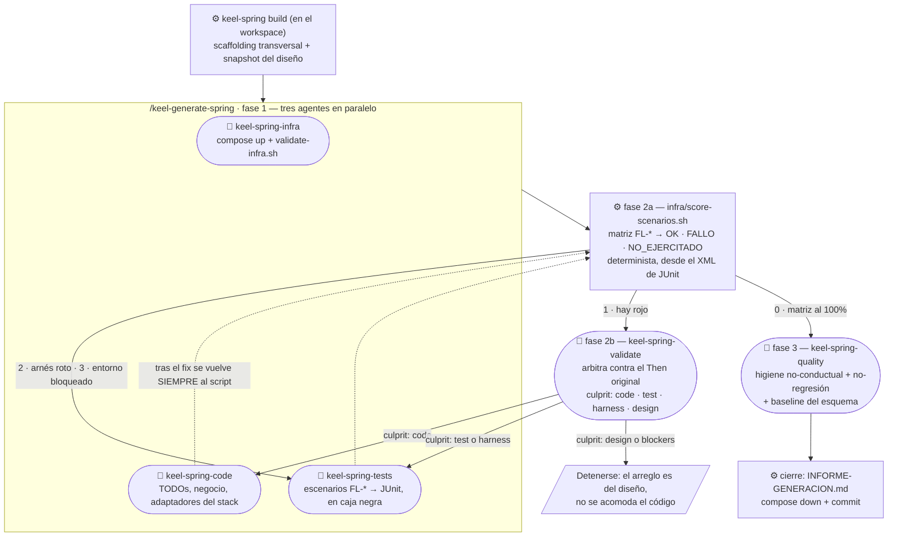

# Keel

**Diseña un servidor una vez. Genéralo en cualquier tecnología.**

## El problema

Encargarle un servidor a un agente funciona hasta que hay que operarlo. Lo que falla no es la sintaxis del código: son cuatro cosas que no se ven al leer el diff.

- **Las decisiones estructurales se toman en silencio.** Outbox o publicación en línea, qué operación se puede repetir sin cobrar dos veces, cuánto puede llegar rancio de una caché, qué transacción envuelve qué, qué pasa cuando el proveedor del que dependemos no responde. Nadie las escribe, así que las decide el agente en el momento de teclear —y un valor decidido y uno asumido se escriben igual—. En Keel son **obligaciones con id estable** que `keel validate` deja en rojo hasta que se declaran en el DSL o se aceptan por escrito, con su motivo, en `specs/<servicio>/decisions.yaml`. Ver [design-obligations.md](packages/keel-core/assets/core/docs/design-obligations.md).

- **Una especificación en prosa no se puede comprobar.** Un Markdown que dice «devuelve 409 si ya existe» no sabe si ese conflicto está en el catálogo de errores del servicio, si el rol que alcanza ese endpoint existe, ni si el evento que promete publicar lo consume alguien. El diseño Keel es un directorio de YAML tipado —una capa por preocupación— y `keel validate` lo comprueba offline y con exit code: **JSON Schema por capa + referencias cruzadas entre capas**.

- **La especificación nace atada al stack.** En cuanto el plan dice «PostgreSQL y Redis», deja de ser reutilizable: cambiar de motor, de broker o de lenguaje es reescribirla. En Keel el stack **no entra al diseño**; se pregunta al generar y se persiste en `keel-stack.json` del proyecto generado. El mismo diseño se regenera en otra tecnología sin tocar una línea.

- **«Terminado» es la palabra del agente.** El criterio aquí es ejecutable: `./gradlew build -x test` en verde **más** `./gradlew integrationTest` con el **100 %** de los escenarios `FL-*` del diseño pasando contra la infraestructura real (base de datos, broker, proveedor de identidad, todo en contenedores), puntuado por un script determinista y no por un juicio.

## Qué lo hace distinto de la SDD tradicional

[spec-kit](https://github.com/github/spec-kit) y [OpenSpec](https://github.com/fission-ai/openspec) especifican **un cambio sobre un repositorio que ya existe**: en prosa, y su salida es un parche sobre ese código. Keel especifica **un servicio entero**, tipado y sin tecnología dentro, y su salida es el servidor. No compiten por el mismo hueco —de hecho, para lo que ellas hacen, Keel no sirve (ver la sección siguiente)—, pero la diferencia de objeto arrastra casi todo lo demás:

| | spec-kit / OpenSpec | Keel |
|---|---|---|
| Objeto de la spec | un cambio o feature sobre un repo vivo | un servicio completo, o un sistema de servicios |
| Formato | Markdown en prosa | YAML tipado, una capa por preocupación |
| Validación | estructura del documento + juicio del agente | JSON Schema + referencias cruzadas + obligaciones abiertas, con exit code |
| Tecnología | entra en el plan (el stack se pasa a `/plan`) | fuera del diseño; se elige al generar |
| Salida | tareas que el agente implementa | proyecto generado: scaffolding determinista + el código que depende de la infra |
| Terminado | la checklist de tareas | suite de integración al 100 % contra infraestructura real |
| Reutilización | dentro del repo | entre stacks **y entre organizaciones** (registry de diseños) |
| Alcance | una feature | un sistema: descomposición, olas de construcción y validación cross-servicio |

Y tres cosas que la tabla no dice:

**El diseño sigue siendo la fuente de verdad después de generar.** Un cambio funcional se hace en el diseño y se regenera; nunca en el código generado. Eso es sostenible porque el proyecto lleva un manifiesto (`keel-generated.json`) que distingue lo que escribió el generador de lo que escribió el agente: un arreglo del generador se propaga con `--refresh --prune` sin pisar la lógica de negocio, y `--check` falla en CI si quedó atrás. En la SDD clásica el código se edita a mano y la especificación se sincroniza después —o se archiva—.

**Nadie aprende el DSL.** El YAML es interlingua entre agentes (uno diseña, otro genera, otro valida); su ventaja sobre un prompt es que es legible, versionable y revisable en un diff pequeño. El humano conversa con `/keel-design` capa a capa y revisa el resultado en el panel `overview.html` y en `DESIGN.md`, no en el YAML.

**Las puertas son ejecutables, no convenciones escritas.** `keel validate`, `keel index --check`, `keel system check`, `infra/check-idempotency.sh`, la suite `FL-*`: lo que sostiene la calidad no es que el agente haya leído una guía, es que algo se pone rojo si no está.

## Qué ganas con Keel

Cuatro cosas, y las cuatro son comprobables con un comando desde este repo.

### Lo derivable no lo escribe un agente

Casi todo lo que hay en un servicio de backend **se deduce del diseño**: si el dominio declara un
agregado con sus invariantes y la capa de casos de uso declara la operación que lo toca, entonces el
controller, el DTO, el comando, el handler, el puerto, el espejo de persistencia, el mapeo de
columnas, la jerarquía de errores, la config por perfiles y la infraestructura de prueba **no son
decisiones**: son consecuencias. Pedírselas a un agente es pagar tokens, tiempo y varianza por
recalcular cada vez lo que una función calcula igual siempre.

Así que no se piden. `keel-spring build` genera de forma determinista **todo lo transversal al
stack** —63 módulos de scaffolding en `packages/keel-spring/src/scaffold/`— y el proyecto compila y
arranca antes de que ningún agente lo haya visto. Al agente le queda solo lo que el diseño
genuinamente no determina: la frontera que depende de la infraestructura elegida (publishers y
listeners del broker, adaptador de storage) y la lógica de negocio con sus invariantes. El reparto
está escrito en [orchestration.md](packages/keel-spring/assets/generators/spring/orchestration.md).

Qué forma tiene eso en la práctica: en la corrida `customer-refunds`, el manifiesto
`keel-generated.json` registró **232 archivos escritos por `build`** frente a **33 tocados por el
agente** — y esos 33 son exactamente la huella de lo no derivable.

**Los árbitros tampoco son agentes.** Quien puntúa los escenarios es un script
(`infra/score-scenarios.sh`, matriz determinista desde el XML de JUnit), y con la suite al 100 % el
pipeline pasa a la fase de calidad **sin invocar a ningún árbitro**. Lo mismo `keel validate`,
`keel index --check`, `keel system check`, `infra/check-idempotency.sh` y
`infra/check-domain-guards.sh`: puertas ejecutables con exit code, no juicios. Un agente solo se
convoca cuando algo está en rojo y hay que decidir de quién es.

Y el corolario: lo determinista es reproducible y **gratis de repetir**. Regenerar el mismo diseño
en otro motor, con otro broker o —cuando haya más generadores— en otro lenguaje no vuelve a costar
ni el diseño ni el andamiaje.

### El diseño se reutiliza, no se repite

El diseño Keel no lleva tecnología dentro: ni ORM, ni framework, ni broker, ni base de datos. Eso lo
hace reutilizable en tres direcciones, y cada una ahorra un trabajo distinto.

- **Entre stacks.** El mismo `specs/<servicio>/` se vuelve a generar eligiendo otro stack. Hoy: 5
  motores relacionales (PostgreSQL, MySQL, MariaDB, SQL Server, Oracle) más MongoDB, 3 brokers
  (Kafka, RabbitMQ, SNS/SQS), 2 proveedores de identidad, 2 cachés y 2 backends de storage.
- **Entre organizaciones.** Los diseños se publican en **registries** —repos con forma de workspace
  Keel—, y hay dos puertas con dos intenciones: `keel registry get <x>` **adopta** el diseño tal
  cual, con sus derivados al día y listo para generar; `keel new <mío> --from registry:<x>` lo
  **deriva**, renombrando y reseteando a `0.1.0` con el linaje estampado en `service.basedOn`. Ver
  [design-registry.md](packages/keel-core/assets/core/docs/design-registry.md).
- **Hacia los proyectos que ya generaste.** Un arreglo del generador no se queda en la versión
  nueva: el manifiesto `keel-generated.json` distingue lo que escribió `build` de lo que escribió el
  agente, así que `build --refresh --prune` propaga el arreglo **sin pisar la lógica de negocio**, y
  `--check` falla en CI si un proyecto quedó atrás. Cuando lo que cambia es el **diseño**, `build`
  calcula el delta y escribe `EVOLUTION.md`: el pipeline entra en modo evolución y trabaja solo
  sobre lo que cambió, no sobre el servicio entero.

Un nivel por encima está el reparto del encargo: `/keel-decompose` decide con el humano qué
servicios hay y dónde está cada frontera, y `keel system` calcula **en qué orden se construyen**
—orden topológico de las dependencias bloqueantes, no declarado a mano—, así que varias personas
diseñan en paralelo sin pisarse. Ver
[system-decomposition.md](packages/keel-core/assets/core/docs/system-decomposition.md).

### Todos los servicios salen iguales

La arquitectura del proyecto generado no es negociable y no la elige el agente: hexagonal + CQRS,
los mismos paquetes, los mismos nombres (`<Agregado>V1Controller`, `<Evento>IntegrationEvent`,
`<Raíz>RefResolver`…), la misma `infra/` de prueba, el mismo `deploy/`, el mismo `docs/keel/`. Está
escrita y viaja **dentro de cada proyecto generado**:
[constitution.md](packages/keel-spring/assets/generators/spring/constitution.md) con las reglas
inviolables, `architecture.md` con la función de cada paquete y **11 conventions** con el detalle
—mapeo, composición de lecturas, modelado de dominio, concurrencia, pruebas de integración…—.

Lo que eso compra:

- **Leer el servicio número N cuesta lo que costó leer el primero.** No hay estilo personal de quien
  lo generó: no aparece un servicio con `shared/`, otro con Modulith y otro con el repositorio
  llamando al controller.
- **La rotación es barata.** Quien sabe moverse por un servicio Keel sabe moverse por todos, y una
  revisión de seguridad o de arquitectura sabe de antemano en qué archivo mirar.
- **Cambiar de motor o de broker no cambia la forma del proyecto** — cambian los adaptadores, no la
  disposición ni los nombres.
- **El proyecto es autosuficiente**: se clona y se termina sin el workspace de diseño, porque lleva
  dentro el snapshot del diseño, los contratos, la skill del generador, sus agentes y las
  conventions.

### Los patrones difíciles vienen puestos — y medidos

Esta es la parte que no se arregla escribiendo mejores prompts. Los mecanismos de fiabilidad
distribuida comparten un rasgo: **cuando están mal, no falla nada visible**. Un relay de outbox cuyo
predicado no casa se comporta exactamente igual que un outbox vacío. Una clave de deduplicación a la
que le falta un campo descarta en silencio mensajes que nadie procesó. Una guarda que confirma
después del efecto manda un segundo correo a una persona real y responde 2xx las dos veces. No hay
excepción, ni log, ni métrica — y no hay escenario de caja negra que lo vea.

Por eso en Keel se **derivan del diseño**, los genera `build` enteros, y cada uno tiene detrás una
red que se ha roto a propósito para comprobar que se pone roja.

| Mecanismo | Qué evita | Quién lo escribe | Qué lo verifica |
|---|---|---|---|
| **Outbox** + relay con lease, backoff, purga y rendición (gauge `keel.outbox.dead_lettered`) | publicar un evento que la transacción acabó revirtiendo — o perderlo y no enterarse | `build` entero; el envío al broker, el agente | `store-check` · escenario de canal indisponible · familia `outboxDelivery` |
| **Idempotencia de petición** (`idempotency_record` + `CommandSignature`) | que el reintento del cliente ejecute el cobro dos veces | `build` entero | `store-check` · familia `commandIdempotency` |
| **Deduplicación de reentrega** del broker (`processed_event` + `IdempotencyGuard`, con sus dos órdenes) | que la segunda entrega del mismo mensaje vuelva a aplicar el efecto | `build` entero | `store-check` · familia `dedupe` |
| **Idempotencia saliente** (`OutboundIdempotency`) | que *nuestro* reintento duplique el cargo en el proveedor | `build`, incluido su uso | familia `outboundIdempotency` |
| **Compensación** (`dependencies.*.compensations`) | trabajo ya encargado a un tercero que se queda hecho cuando el flujo se cae | el agente, en handler y agregado | familia `compensation` |
| **Reconciliación** (`activations.*.reconciledBy`) | la fila que espera para siempre un desenlace que nunca llegó | `build` genera el reclamo | `store-check` · familia `reconciliation` · escenario de espera agotada |
| **Reclamo de barrido** y **rescate** de filas en vuelo con cota temporal | dos réplicas procesando la misma fila; y la fila que una réplica muerta dejó a medias | `build` entero | `claim-check` · familia `sweepClaim` |
| **Guarda de efecto externo irreversible** sobre una fila | el segundo correo real, el segundo envío: el efecto que no se puede deshacer | `build` entero | `claim-check` · familia `mailDelivery` |
| **Unicidad condicionada al estado** (índice parcial, columna generada o `partialFilterExpression`) | dos filas activas a la vez por una carrera que la comprobación previa del handler no cierra | `build` entero | `index-check` · familia `conditionalUniqueness` |
| **Eventos de dominio** con buffer `raise`/`pull`, `EventEnvelope` y correlación end-to-end | el evento que se publica sin que el hecho haya ocurrido, y la traza que se corta al salir del proceso | `build` entero | familia `domainEvent` |
| **Circuit breaker + retry** con fallback tipado y la política `onFailure` del diseño | que un proveedor caído se lleve por delante el servicio entero | `build` entero | escenarios `FL-*` contra un proveedor de prueba (WireMock) |
| **Caché** con TTL por caché y degradación a miss | servir datos rancios sin que nadie haya dicho cuánto es demasiado | `build` entero | escenarios `FL-*` |
| **Seguridad**: realm aprovisionado, matriz M2M, identidad del llamante, alcance por recurso | que el llamante elija de qué inquilino lee | `build` entero | `compile-check --auth=` · tests que **ejecutan** el script de aprovisionamiento |

El gate `infra/check-idempotency.sh` que el proyecto generado lleva dentro cubre **11 familias** y
cierra el tramo donde `build` pone el mecanismo y el agente escribe el uso: sale rojo sobre el árbol
recién generado y tiene que estar verde para cerrar.

**Y la disciplina que lo sostiene: medición por mutación.** Una red que nadie ha roto nunca no
distingue «no hay errores» de «no mira» — algo que aquí ya ha pasado, y por eso se mide.
`npm run matrix` imprime la matriz de paridad del generador: hoy **46 celdas, 31 verificadas
ejecutándolas contra un motor real, y 30 de esas 31 falsadas** rompiendo el mecanismo a propósito y
comprobando que su red se pone roja. Las 9 que nadie ha ejecutado aún salen listadas como tales, y
lo que un motor **no** sostiene —la unicidad condicionada en MariaDB y en Oracle— se declara
`degradado`, con la garantía que se pierde y las salidas disponibles, en vez de fingirse. El
catálogo de mutaciones canónicas está en
[orchestration.md § Medición por mutación](packages/keel-spring/assets/generators/spring/orchestration.md).

## Cuándo usar Keel — y cuándo no

**Sí:**
- un servicio de backend **nuevo**, que aún no tiene código;
- un encargo con **varios servicios** dentro y fronteras por decidir;
- el mismo dominio en **más de un stack** (o migrando de uno a otro);
- un diseño que alguien tiene que **aprobar antes** de que exista código.

**No** (y ahí spec-kit u OpenSpec encajan mejor):
- evolucionar un repositorio existente que no salió de Keel;
- frontend, scripts, trabajo exploratorio;
- un cambio de una tarde sobre algo que ya funciona.

## Cómo funciona, en un minuto

1. **Diseño agnóstico por capas** — la funcionalidad del servicio se condensa en un directorio de **artefactos declarativos relacionados** (`specs/<servicio>/`): un manifiesto más una capa por preocupación —dominio, casos de uso, API, seguridad, mensajería, clientes HTTP, persistencia…—. Cada capa se itera con el humano por separado y ninguna menciona framework, ORM, broker ni lenguaje.
2. **Generación dirigida por agentes** — el generador de una tecnología valida el diseño, pregunta el stack y genera de forma determinista todo lo que no depende de la infra elegida; un agente completa el resto y lo verifica contra los escenarios del diseño.
3. **Documentación derivada** — al cerrar el diseño salen solos el documento reutilizable (`DESIGN.md`), el índice del workspace y, cuando hace falta integrar, la guía de integración, OpenAPI/AsyncAPI y el panel visual.

El mismo diseño se regenera tantas veces como se quiera, en tecnologías distintas, sin re-diseñar nada.

Cuando el encargo no es un servicio sino un **sistema**, hay una fase previa: `/keel-decompose` decide con el humano qué servicios hay y dónde está la frontera de cada uno, `keel system` calcula **en qué orden se construyen** —quien publica contrato va antes que quien lo consume— y contrasta el mapa contra los diseños reales. Cada servicio sale con su propio *brief*, así que varias personas diseñan en paralelo. Ver [system-decomposition.md](packages/keel-core/assets/core/docs/system-decomposition.md).

Y como un diseño sin tecnología dentro es reutilizable **entre organizaciones**, no solo entre stacks, los diseños se publican en **registries**: repositorios con la forma de un workspace Keel de los que se descubre y deriva un diseño existente en vez de empezar en blanco. El oficial es [keel-system/keel-registry](https://github.com/keel-system/keel-registry); crear uno privado es `keel init` + `keel index`. Ver [design-registry.md](packages/keel-core/assets/core/docs/design-registry.md).

## Paquetes

Este repo es un **monorepo npm workspaces** con dos tipos de paquete:

| Paquete | CLI | Qué hace |
|---------|-----|----------|
| `packages/keel-core` | `keel` | El core: siembra workspaces, crea servicios y valida diseños. Define el DSL (schemas, docs, plantillas) y expone su validación como librería para los generadores. |
| `packages/keel-spring` | `keel-spring` | Generador Spring Boot: `build` valida el diseño, pregunta el stack y genera `services/<servicio>-spring/` con el scaffolding transversal (el proyecto arranca) más el `.claude/` de ese proyecto —skill, agentes, conventions y skills del stack—; en el workspace de diseño no escribe nada. El código dependiente de la infra elegida y la lógica de negocio los completa el agente. Futuro: `keel-nest`, `keel-fastapi`, … |

## Instalación

```bash
npm i -g keel-core     # comando `keel`
npm i -g keel-spring   # comando `keel-spring` (el generador de la tecnología que uses)
```

Node.js >= 18. El core y cada generador son paquetes independientes: se instala el core más los generadores que se vayan a usar.

Para trabajar sobre **este repo** (desarrollo del propio Keel):

```bash
git clone https://github.com/keel-system/keel.git && cd keel
npm install
npm link --workspace packages/keel-core          # comando `keel`
npm link --workspace packages/keel-spring        # comando `keel-spring`
```

## Uso

```bash
mkdir mi-proyecto && cd mi-proyecto

keel init            # siembra el workspace: skills, schemas, plantillas, docs

# ¿El encargo es un SISTEMA (varios dominios) y no un servicio? Descomponerlo primero.
# En Claude Code, dentro del workspace:
#   /keel-decompose docs/system/tdr.md       decide fronteras con el humano y escribe
#                                            system.yaml (el mapa), docs/system/SYSTEM.md (el porqué)
#                                            y un docs/system/briefs/<servicio>.md por servicio
keel system                               # olas de construcción: quién se puede diseñar ya, y en paralelo
keel system check                         # ¿el mapa sigue coincidiendo con los diseños? (puerta de CI)

# ¿Ya existe un diseño que resuelva esto? Adoptarlo no cuesta nada; derivarlo, una
# revisión; diseñarlo de cero, una sesión de entrevista capa a capa.
keel registry search catalogo             # busca en el registry de diseños reutilizables
keel registry show catalog                # su ficha, sin descargarlo
keel registry get catalog                 # ¿sirve tal cual? lo adopta sin tocarlo, con sus
                                          # derivados al día: listo para generar
keel new mi-servicio --from registry:catalog   # ¿hay que cambiarlo? lo deriva con linaje basedOn:
                                          # solo el spec, porque el diseño se va a completar

keel new mi-servicio # …o de cero: specs/mi-servicio/ (manifiesto + domain + use-cases)

# En Claude Code, dentro del workspace:
#   /keel-design specs/mi-servicio           diseña capa a capa; al cerrar genera
#                                            validation-scenarios.md, docs/mi-servicio/DESIGN.md
#                                            y actualiza el índice README.md del workspace
keel validate specs/mi-servicio              # schemas por capa + referencias cruzadas

#   /keel-docs specs/mi-servicio             → openapi.yaml, asyncapi.yaml, Postman y overview.html
#   /keel-handoff specs/mi-servicio          → regenera DESIGN.md + índice si el spec cambió

# Generar: dos pasos, con un cd en medio.
keel-spring build specs/mi-servicio   # valida, pregunta el stack y genera services/mi-servicio-spring/
cd services/mi-servicio-spring
# En Claude Code, abierto en esa raíz:
#   /keel-generate-spring                    → sin argumentos; completa el proyecto y valida los escenarios
```

## Cómo se genera: cinco agentes iterando

Dentro del proyecto generado, `/keel-generate-spring` **no escribe código**: orquesta cinco
subagentes y decide el avance (*gating*) sobre el bloque estructurado —`status`, `blockers`,
`failures`— con el que cada uno cierra su reporte. En el diagrama, los nodos **redondeados con
🤖** son sesiones de agente (cuestan contexto y tiempo) y los **rectos con ⚙** son deterministas
—un script o una decisión del orquestador— y no cuestan nada: el camino verde va del script a la
fase 3 **sin invocar a ningún árbitro**.

Criterio de terminado: `./gradlew build -x test` en verde más `./gradlew integrationTest` con el
**100 %** de los escenarios `FL-*` en OK contra la infraestructura real.



El pipeline completo —gating, handoffs campo a campo, ciclos de fix y su cupo— está en
[orchestration.md](packages/keel-spring/assets/generators/spring/orchestration.md).

## Comandos

| Comando | Qué hace |
|---------|----------|
| `keel init [--force] [--check]` | Copia al directorio actual todo lo necesario: skills del agente, schemas por capa, plantillas, docs y `CLAUDE.md`. Nunca sobrescribe sin `--force`. Con `--check` no escribe y falla si alguna copia del payload quedó atrás respecto a la CLI instalada (ignora los archivos que el workspace puede editar). |
| `keel new <servicio> [--from <origen>]` | Crea `specs/<servicio>/` con manifiesto + capas obligatorias desde plantillas. Con `--from` deriva de un diseño existente (nombre local, ruta, o `registry:<diseño>`) estampando el linaje en `service.basedOn`. |
| `keel list` | Lista los generadores conocidos y su paquete npm. |
| `keel validate <ruta>` | Valida un servicio (directorio o manifiesto): schema de cada capa + referencias cruzadas entre artefactos (offline, con todos los errores). |
| `keel describe <servicio>` | Resume un diseño para leerlo o reutilizarlo: identidad, estado, capas, contenido por capa y frescura de sus derivados. |
| `keel index [--check]` | Genera el índice de diseños del workspace: la tabla del `README.md` (solo entre marcadores) y `index.json`. Con `--check` no escribe y falla si quedó atrás — es la puerta de CI de un registry. |
| `keel system [show \| check]` | Lee el mapa del sistema (`system.yaml`, de `/keel-decompose`). `show` (por defecto, con `--json`) muestra las **olas de construcción** —calculadas como orden topológico de las aristas bloqueantes, no declaradas—, el estado de cada servicio, el mapa de contextos y quién puede diseñarse ya. `check` contrasta el mapa contra los diseños reales: es la **única comprobación cross-servicio** (`keel validate` no ve más allá de un servicio) y llega a cruzar dos specs — que el proveedor publique de verdad el evento que el mapa promete a su consumidor. Ninguno escribe nada. |
| `keel registry [list\|search\|show]` | Explora el registry de diseños reutilizables. Fuente configurable con `--source` o `KEEL_REGISTRY_URL`; caché en `~/.keel/registry/` con `--refresh` y `--offline`. |
| `keel-spring build <ruta> [--force] [--defaults]` | Comprueba la compatibilidad DSL, valida el diseño, pregunta el stack (persistido en `keel-stack.json`) y genera en `services/<servicio>-spring/` el scaffolding transversal al stack más el `.claude/` del agente (skill, agentes, conventions, skills del stack) y los snapshots de `specs/` y `docs/`. No escribe nada en el workspace de diseño. |

## El workspace sembrado

```
mi-proyecto/
├── AGENTS.md / CLAUDE.md     # el flujo, para el agente — un archivo de contexto por harness
├── README.md                 # índice de servicios diseñados (enlaza cada DESIGN.md) — página de entrada del repo
├── .claude/skills/           # las ocho skills del flujo de diseño, proyectadas a cada harness
├── .opencode/skills/         # soportado desde una fuente única: keel-decompose, keel-design,
│                             # keel-consume, keel-validate, keel-docs, keel-integrate,
│                             # keel-handoff, keel-evolve
├── schema/                   # un JSON Schema por capa + common.schema.json
├── system.yaml               # el mapa del sistema, si hay más de un servicio (de /keel-decompose)
│                             # NO es una capa del DSL: reparte el encargo, no describe un servicio
├── specs/<servicio>/         # el diseño de cada servicio, un artefacto por capa — la fuente de verdad
│   ├── service.keel.yaml     #   manifiesto: identidad + capas declaradas
│   ├── domain.keel.yaml      #   entidades, types, invariantes (obligatoria)
│   ├── use-cases.keel.yaml   #   operaciones, idempotencia, caché (obligatoria)
│   └── *.keel.yaml           #   api, security, messaging, http-clients, dependencies, persistence (opcionales)
├── templates/service/        # una plantilla por capa
├── contracts/<proveedor>/    # INTEGRATION.md de servidores externos de los que dependemos (entrada de /keel-consume)
├── index.json                # índice máquina de los diseños (keel index) — lo consume `keel registry`
├── docs/                     # methodology, dsl-reference (índice), dsl/<capa>.md, building-a-generator,
│                             # design-registry (diseños reutilizables), system-decomposition (el mapa)
├── docs/system/              # el encargo y su descomposición: tdr.md, SYSTEM.md (fronteras y su porqué)
│                             # y briefs/<servicio>.md — un encargo por servicio, entrada de /keel-design
└── services/<servicio>-<tech>/  # servicios generados por `keel-<tech> build` (un repo git propio cada uno)
    ├── .claude/              #   la skill del generador, sus agentes y conventions — el flujo de generación
    └── specs/                #   snapshot del diseño: el proyecto se completa sin el workspace
```

El workspace es **solo diseño**: no aloja skills ni convenciones de generadores. Todo el conocimiento de generación vive dentro de cada proyecto generado.

## Principios

- **El diseño es la fuente de verdad.** Todo lo que un generador necesita saber está en los artefactos; ninguna decisión de negocio queda implícita.
- **Ninguna decisión estructural sin respuesta.** Outbox, idempotencia, caché, superficie M2M, frontera transaccional, política de fallo: el agente recomienda con su porqué, el humano decide, y lo que queda sin decidir bloquea la validación hasta que se declara o se acepta por escrito en `decisions.yaml`.
- **Cero tecnología en el diseño.** ORM, framework, broker, proveedor de auth o base de datos concreta se deciden al generar, nunca al diseñar.
- **Iterable por humanos y agentes, capa a capa.** Cada artefacto es YAML legible y pequeño: un humano revisa una capa en un diff, un agente la produce y la consume; las capas se relacionan por nombre y `keel validate` comprueba las referencias.
- **Regenerable.** Cambiar de stack es re-ejecutar la generación, no reescribir el diseño.

## Estado y roadmap

- **DSL Keel 2.13**: diez capas (dos obligatorias, ocho opcionales) con validación en tres niveles — JSON Schema por capa, referencias cruzadas mecánicas y revisión semántica del agente.
- **CLI `keel` completa**: `init`, `new`, `list`, `validate`, `describe`, `index`, `system` y `registry`, más las ocho skills del flujo de diseño que siembra `keel init`.
- **Un generador en producción**: `keel-spring` (Spring Boot 3.5 / Java 21) — **63 módulos de scaffolding determinista**, 6 motores de base de datos (5 relacionales + MongoDB), 3 brokers, 2 proveedores de identidad, 2 cachés y 2 backends de storage, con **11 skills por tecnología** y orquestación de cinco subagentes con puntuación determinista de escenarios. Criterio de terminado: `./gradlew build -x test` en verde más `./gradlew integrationTest` con el 100% de los escenarios `FL-*` en OK contra la infraestructura real.
- **Verificación del propio generador**: **87 suites de test** (`npm test`), **11 fixtures de diseño** —4 de modelo documental y 7 relacional, dos de ellas **pares byte a byte** que solo se diferencian en el modelo de persistencia, que es lo que impide que una rama se quede atrás en silencio— y **8 redes que ejecutan de verdad** contra motores, brokers y buzones en contenedores (`compile-check`, `claim-check`, `store-check`, `index-check`, `mapping-check`, `broker-check`, `mail-check`, `mongo-check`). Su estado, celda a celda, lo imprime `npm run matrix`: **46 celdas · 31 verificadas · 30 falsadas · 9 sin ejecutar · 2 degradadas**.
- **Publicado en npm**: [`keel-core`](https://www.npmjs.com/package/keel-core) y [`keel-spring`](https://www.npmjs.com/package/keel-spring), instalables con `npm i -g`.
- **Pendiente**: más generadores (`keel-nest`, `keel-fastapi`); detección de drift entre spec y **código generado** —la de spec ↔ documentación ya la cubren los sellos de versión y `keel describe`—; sincronización inversa.

## Contribuir: estructura de este repo

```
keel/
├── package.json                  # raíz privada: workspaces packages/*
└── packages/
    ├── keel-core/                 # el core (Node 18+, ESM, sin build step)
    │   ├── src/
    │   │   ├── cli.js            # entry (commander): init, new, list, validate
    │   │   ├── index.js          # API pública para generadores (validateService, loadService, …)
    │   │   ├── commands/
    │   │   └── lib/              # assets, copia, carga multi-artefacto, referencias cruzadas
    │   └── assets/core/          # lo que `keel init` siembra (skills, schemas, plantillas, docs)
    └── keel-spring/              # generador Spring Boot
        ├── src/                  # CLI: comando build + scaffolding transversal (src/scaffold, src/lib)
        └── assets/               # lo que `keel-spring build` instala (skill + agentes + conventions + skills por tecnología)
```

Los assets **son** la metodología: el DSL se documenta en `packages/keel-core/assets/core/docs/dsl-reference.md`, el schema vive en `packages/keel-core/assets/core/schema/`, y cada generador en su propio paquete `packages/keel-<tech>/`. Para crear un generador nuevo: [building-a-generator.md](packages/keel-core/assets/core/docs/building-a-generator.md). La metodología completa, en [methodology.md](packages/keel-core/assets/core/docs/methodology.md).

## Autor y licencia

Keel lo diseña y mantiene **[asuridev](https://github.com/asuridev)** — el DSL, la metodología, la CLI y el generador Spring.

Publicado bajo licencia [MIT](LICENSE). Si lo usas en un proyecto o construyes un generador sobre él, la atribución se agradece; las [issues](https://github.com/keel-system/keel/issues) y las propuestas de generador, más.
