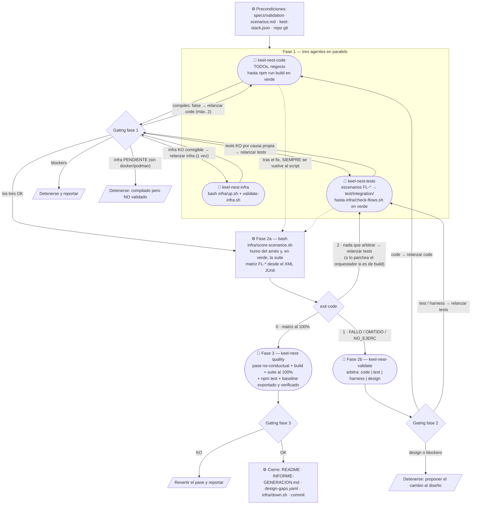

# Orquestación de agentes — cómo se completa el proyecto

Cómo la skill `/keel-generate-nest` —ejecutada **dentro de este proyecto**, sin argumentos— lo completa
hasta dejarlo funcional y validado. La skill **no escribe código**: es la **orquestadora** de cinco
subagentes, y decide el avance y los relanzamientos (gating) sobre el bloque estructurado (`status`,
`blockers`, `failures`…) con el que cada uno cierra su reporte.

Es el **mismo pipeline** que el de keel-spring, con las mismas fases, los mismos códigos de salida y la
misma regla de quién arbitra: el objetivo de keel-nest es que el mismo diseño produzca un servidor
equivalente, y para eso también tiene que validarse igual. Lo que cambia son los comandos.

Lo **determinista** —ejecutar la suite y derivar la matriz de escenarios del XML JUnit— lo hace el
orquestador con `infra/score-scenarios.sh`; el agente de arbitraje solo se invoca cuando esa matriz trae
algo en rojo. Una generación que sale limpia no gasta una sesión en decir «todo OK».

## Punto de partida: qué dejó hecho `build`

`keel-nest build` ya generó de forma **determinista** todo lo transversal: el proyecto compila y
arranca, con dominio puro (value objects con sus guardas, agregados con su lifecycle, errores), puertos,
mensajes y handlers con `TODO`, el mediator con su transacción, la API REST entera (controladores,
lectura y validación de cada petición, `ErrorResponse`), la persistencia TypeORM (entidades,
adaptadores con su mapeo, bloqueo optimista, traducción de constraints), la configuración por perfiles,
la infraestructura de prueba en `infra/` y el arnés de integración. Lo que queda para los agentes es la
**lógica de negocio** con sus invariantes, lo que los puertos necesiten además de lo derivable, las
pruebas de los escenarios y la validación contra el servidor real.

> **Sin pruebas unitarias nuevas; con pruebas de integración.** Los escenarios `FL-*` de
> `validation-scenarios.md` se traducen **una vez** a pruebas de integración (Vitest, `test/integration/`,
> caja negra contra el contrato) y se ejecutan contra la infraestructura real. El criterio de «generación
> terminada» es `npm run build` en verde + el **100%** de los escenarios en OK. Las pruebas que `build`
> dejó en `test/*.test.ts` (arranque bajo el perfil `test`, configuración, contrato del cable, API) se
> conservan y se ejecutan en la fase 3 con `npm test`: no se escriben otras.

## El pipeline

## Por qué la fase 1 son tres agentes y ninguno espera a otro

Todos sus insumos están en disco antes de empezar (`specs/`, `keel-stack.json`, `infra/`, el arnés), así
que no hay arista entre ellos:

- **`tests` no espera a `infra`**: escribir las pruebas no toca un contenedor; su gate es compilar.
- **`tests` no espera a `code`, y no puede quedar preso de él**: `infra/check-flows.sh` compila las
  pruebas de flujo y **solo cuenta sus errores**. `tsc` sigue los imports del arnés hasta `src/`, así que
  un `src/` a medio escribir también da errores; el script los lista aparte como de otro, sin ponerse en
  rojo. Es el equivalente del source set de keel-spring que compila sin `src/main/java`.
- **El paralelismo es la garantía de independencia**: el autor de las pruebas nunca ve el código
  terminado (no lee `src/`), así que el test no puede acomodarse a lo que el código hace. Y la caja negra
  es estructural: la regla `flujos-caja-negra` de `npm run check:architecture` rechaza un flujo que
  importe `src/`.

## Por qué la fase 2 está partida en dos

Ejecutar la suite y derivar «FL-x → OK | FALLO» del XML **no requiere criterio**: es parsear, y lo hace
el script con los mismos programas con los que keel-spring puntúa su XML. Decidir de quién es la culpa
de un fallo sí lo requiere, y no puede hacerlo quien tiene que poner la suite en verde: si fuera
`keel-nest-code`, `culprit: test` sería su salida barata y el `Then` acabaría ajustándose al código.

El script lo invoca el orquestador y por eso su salida es compacta: la de Vitest va entera a
`build/keel-scenarios/run.log` y por stdout solo sale la matriz. El orquestador es la sesión más larga
del pipeline; no vuelques ese log en su contexto salvo para diagnosticar.

## Los códigos de `score-scenarios.sh`

| Código | Significa | Qué se hace |
|---|---|---|
| `0` | matriz al 100% | fase 3, sin invocar al árbitro |
| `1` | hay `FL-*` en FALLO, OMITIDO o NO_EJERC | fase 2b: `keel-nest-validate` con la matriz y los volcados |
| `2` | **nada que arbitrar**: el humo del arnés está rojo, la matriz está vacía, la suite falló por pruebas que no son escenarios, un flujo no llegó a arrancar sin dejar ningún FALLO, o `specs/` no casa con su sello | relanzar `keel-nest-tests` (no consume cupo) — salvo que el defecto esté fuera de `test/integration/` |

(El código `3` de keel-spring —workers de Gradle que sostienen `build/`— no existe aquí.)

### Un exit 2 no siempre es del agente de pruebas

El humo cae por dos causas de dueños distintos:

- **Dentro de `test/integration/`** (una prueba de flujo, o `support/flow.ts`): del agente de pruebas.
- **Fuera**: `infra/`, `package.json`, la configuración de Vitest. Eso lo escribe `keel-nest build`; lo
  corrige el orquestador y va a `INFORME-GENERACION.md` como fix del **generador** a portar.

### Un flujo que no arranca sale OMITIDO

En Vitest, si el arranque de un archivo de flujo falla (el `beforeAll` de `useFlow()`: el servidor no
arranca, el reset de la infraestructura falla), sus casos salen como **OMITIDOS**, no como fallidos.
`useFlow()` vuelca entonces `build/keel-failures/<flujo>-init.json` con la causa y el último sondeo, y
el script lo lista como arnés roto. Si la causa es el **comportamiento del servidor** (no arranca porque
el código está mal), es `culprit: code` como cualquier otro rojo.

### Un `NO_EJERC` es rojo, y tiene dueño

Un escenario declarado en `validation-scenarios.md` que ninguna prueba ejercita sale `NO_EJERC` y el
script sale con `1`. Si se puede escribir, es cobertura que falta (`keel-nest-tests`, sin cupo); si no se
puede por la superficie que el propio escenario exige, es `culprit: design` y **se detiene**. Y detenerse
significa no tocar el diseño, ni aquí ni en el workspace: un `culprit: design` se **propone** en
`design-gaps.yaml` y en el informe. `score-scenarios.sh` comprueba el sello de `specs/` y sale con `2` si
alguien lo editó.

## Los cinco agentes

| Agente | Responsabilidad | Qué NO hace |
|---|---|---|
| `keel-nest-code` | TODOs, lógica de negocio, invariantes, ampliar puertos de repositorio, hasta `npm run build` en verde, con `check:architecture` y los gates estáticos. Antes de cada handler, la auditoría de `conventions/flow-fidelity.md`. Relanzado desde la fase 2, lee la evidencia cruda y verifica su fix con el archivo de flujo afectado. | No escribe pruebas, no toca `test/`, no levanta contenedores. Su verde por archivo no aprueba escenarios. |
| `keel-nest-infra` | Levanta `infra/` (`bash infra/up.sh`) y la sondea (`bash infra/validate-infra.sh`); la deja arriba. | No edita código ni scripts de `infra/`. |
| `keel-nest-tests` | Traduce **una vez** los escenarios a `test/integration/<flujo>.test.ts`, en caja negra, hasta `bash infra/check-flows.sh` en verde. | **No lee `src/`**, no implementa negocio, no ejecuta las pruebas en la fase 1. |
| `keel-nest-validate` | **Árbitro**: decide, contra el `Then` original y los volcados de `build/keel-failures/`, si cada fallo es `code`, `test`, `harness` o `design`. Solo corre si hay rojo. | No ejecuta la suite ni compone la matriz; no corrige código ni pruebas. |
| `keel-nest-quality` | Pase **no-conductual**, la no-regresión (la suite al 100%), `npm test` (lo que `build` dejó en `test/`), los gates estáticos y el **baseline de migraciones**: lo exporta (`infra/export-schema.sh`), lo revisa, lo copia a `src/migrations/` y lo **verifica en vivo** (`infra/verify-baseline.sh`). | Nada conductual: se reporta en `remaining`. |

Regla común: ningún agente pregunta al usuario —registra sus bloqueos en `blockers` y termina— y ningún
hueco del diseño se resuelve en silencio en el código: se propone en `designGaps`.

**La orquestación es de un solo nivel.** Los cinco son **hojas**: el único que invoca agentes es la
skill. El cupo de ciclos se cuenta sobre las invocaciones del orquestador, el gating se decide sobre el
bloque del agente invocado, y las restricciones que hacen válida la validación —el de pruebas sin leer
`src/`, el árbitro sin corregir, el de calidad sin cambiar comportamiento— son **del agente**: un
subagente lanzado por él no las heredaría.

## Handoffs

| Campo | Lo emite | Lo consume | Para qué |
|---|---|---|---|
| `compiles` / `failures` | code | orquestador | relanzar code con sus errores (máx. 2 ciclos en fase 1) |
| `status: PENDIENTE`, `runtime` | infra | orquestador | detenerse sin docker/podman; el runtime del `down` final |
| `classes` / `uncovered` / `assumptions` | tests | orquestador, validate | qué flujos se tradujeron, qué no y por qué, y qué se dio por cierto de la infraestructura |
| matriz + `exit code` | ⚙ `score-scenarios.sh` | orquestador | `0` → fase 3 · `1` → árbitro · `2` → arnés |
| `failures[].culprit` + `evidence` + `file` | validate | orquestador, code/tests relanzados | a quién relanzar y con qué evidencia exacta |
| `blocking: systemic \| scoped` | validate | orquestador | cómo se cuenta el ciclo |
| `harnessPatches` | tests (relanzado) | orquestador, informe | parches al arnés: son defectos del generador |
| `verifiedFiles` | code (relanzado) | orquestador | qué archivos de flujo verificó; NO aprueba escenarios |
| `baseline` / `baselineTested` | quality | orquestador, README | el baseline commiteado y verificado en vivo |
| `scenarios` / `unitTests` | quality | orquestador | no-regresión y `npm test` |
| `remaining` / `designGaps` / `blockers` | cualquiera | usuario, informe | lo que queda pendiente de decisión |

## El ciclo de fix se verifica a sí mismo, pero no se aprueba a sí mismo

El agente relanzado en la fase 2 cierra ejecutando **los archivos de flujo que le señaló el arbitraje**
(`npx vitest run --config vitest.integration.config.ts test/integration/<flujo>.test.ts`). Ese verde no
aprueba nada: un fix puede regresionar otro flujo, y la matriz sale del XML de **una** ejecución
completa. Tras cualquier ciclo de fix se vuelve **siempre** a `bash infra/score-scenarios.sh`.

Si una tanda mezcla `culprit: code` con `culprit: test`/`harness`, se relanzan **en serie** (primero
code): los dos ejecutan flujos sobre la misma base, y el reset de uno borra los datos del otro.

## Un solo actor sobre el proyecto

Mientras un agente está vivo, nadie más toca este directorio —el orquestador incluido—: el script
sobrescribe `build/keel-failures/` (la evidencia que el árbitro está leyendo) y el reset vacía la base
que otro está usando. Y el trabajo de un agente no lo hace el orquestador aunque sepa hacerlo: las
restricciones que lo hacen válido son del agente. La única ventana del orquestador es la fase 2a y el
cierre.

## Ciclos de fix

El cupo de la fase 2 son los ciclos código → re-puntuación por fallos puntuales (`blocking: scoped`), y
escala con el número de flujos `FL-*`:

| Flujos `FL-*` | Ciclos `scoped` | Tope duro |
|---|---|---|
| hasta 10 | 2 | 4 |
| 11–20 | 3 | 5 |
| más de 20 | 4 | 6 |

No consumen cupo los ciclos que cierran un bloqueo sistémico (`blocking: systemic`: una causa
transversal que impedía ejercitar casi cualquier escenario), ni los `culprit: test` o `harness`, que no
dicen nada del código. Alcanzado el tope, se reporta la matriz y se detiene.

## El cierre devuelve al generador lo que es del generador

El cierre escribe `INFORME-GENERACION.md` en la raíz, que abre con **la matriz final y su código de
salida, literales** —si no está al 100%, el proyecto no está cerrado—, y sigue con: (1) incidencias del
generador (`harnessPatches`, fixes de `infra/` o de la configuración, los `failures` con `culprit:
harness`), cada una diciendo **de quién es**; (2) código determinista mejorable; (3) agentes y
convenciones donde un ciclo fue largo por falta de un antecedente; (4) huecos del diseño.

Y los huecos del diseño se escriben además en `design-gaps.yaml` (schema `design-gaps.schema.json` de
keel-core, sellado con el `service` y la `version` de `specs/service.keel.yaml`), una entrada por hueco
con `layer`, `unit`, `kind`, `proposal`, `source` y el `scenario` que lo destapó. `keel-nest check`
los imprime desde el workspace y `/keel-evolve` los recoge. **Copia ese archivo fuera del proyecto antes
de tirarlo**: comparar huecos entre corridas es lo que distingue el hueco de un diseño del hueco del
método.

## Autosuficiencia del proyecto

`build` deja aquí todo lo que el pipeline necesita: la skill orquestadora, los cinco agentes, las
convenciones (`{{keel:docs}}/conventions/`), `architecture.md`, `constitution.md`, la skill de la base de
datos y el snapshot del diseño en `specs/`. El canónico del diseño sigue siendo `specs/<servicio>/` del
workspace: un cambio funcional se hace allí y se re-ejecuta `keel-nest build`.
