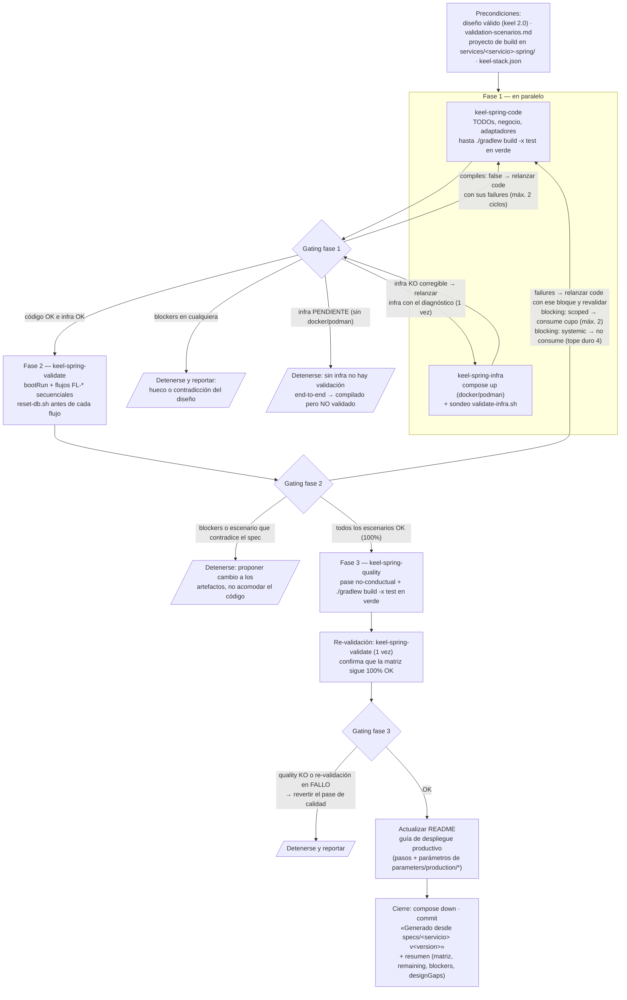

# Orquestación de agentes — cómo se genera el código

Cómo la skill `/keel-generate-spring` completa un proyecto generado por `keel-spring build`
hasta dejarlo funcional y validado. La skill **no escribe código**: es la **orquestadora**
de cuatro subagentes instalados en `.claude/agents/` (del workspace y del proyecto
generado), y toma sus decisiones de avance/relanzamiento (gating) sobre el bloque
estructurado (`status`, `blockers`, `failures`…) con el que cada agente cierra su reporte.

## Punto de partida: qué dejó hecho `build`

`keel-spring build` ya generó de forma **determinista** todo lo transversal al stack
(ver [README.md](README.md)): el proyecto compila y arranca, con dominio puro, puertos,
contratos CQRS + `UseCaseMediator`, controllers, JPA, seguridad, stubs con `// TODO`,
config por perfiles e infraestructura de prueba en `infra/`. Lo que queda para los
agentes es la **frontera dependiente de la infraestructura elegida** (publishers/listeners
del broker, adaptador de storage), la lógica de negocio con sus invariantes y la
validación funcional contra el servidor real.

> **Sin pruebas unitarias en este flujo.** El criterio de "generación terminada" es
> `./gradlew build -x test` en verde + el **100%** de los escenarios `FL-*` de
> `validation-scenarios.md` ejecutados en vivo. La suite de pruebas unitarias es un
> proceso **independiente y posterior**, que arranca cuando el diseñador ha validado
> el funcionamiento del servidor. El andamiaje de test que deja `build` (deps, perfil
> `test` con H2, `<Nombre>ApplicationTests`) se conserva intacto para esa fase.

## El pipeline

Antes del commit de cierre, con la re-validación en 100% OK, el orquestador actualiza la
sección `## Despliegue en producción` del `README.md` del proyecto: pasos para levantar el
servidor en production y la tabla de parámetros obligatorios, derivados de
`src/main/resources/parameters/production/*.yaml` (todo `${VAR}` sin default) y del stack, más
lo que los agentes cablearon al completar los adaptadores. El scaffolding deja un baseline
determinista de esa sección; el orquestador la reconcilia con el código final.

## Los cuatro agentes

| Agente | Responsabilidad | Qué lee | Qué NO hace |
|---|---|---|---|
| `keel-spring-code` | Completa TODOs, lógica de negocio, invariantes y adaptadores del stack hasta `./gradlew build -x test` en verde. Antes de cada handler ejecuta la auditoría de [flow-fidelity](conventions/flow-fidelity.md). | `.claude/CLAUDE.md` del proyecto (orden de capas), `architecture.md`, `constitution.md`, `specs/`, conventions ([mapping](conventions/mapping.md) estricto) y las skills `keel-spring-<tech>` del stack (SKILL.md primero, `references/` bajo demanda). | No escribe pruebas unitarias ni ejecuta `./gradlew test`; no toca contenedores, no ejecuta `bootRun` ni escenarios funcionales. |
| `keel-spring-infra` | Levanta `infra/docker-compose.yaml` con docker o podman (detección: `$CONTAINER_RUNTIME` → `docker` → `podman`), sondea con `infra/validate-infra.sh` (reintentos) y deja la infraestructura **arriba** para la validación. Con auth, prepara lo mínimo para obtener token. | [infra-validation](conventions/infra-validation.md) (sondeo por tecnología vía el contenedor `devtools`), la reference de auth del stack. | Nunca edita código del proyecto; solo corrige causas operativas (puerto ocupado, contenedor viejo). No baja la infraestructura al terminar. |
| `keel-spring-validate` | **Gate de la generación** (única red de seguridad funcional: exige 100% de escenarios OK). Arranca el servidor real (`./gradlew bootRun`) y ejecuta los flujos `FL-*` de `specs/validation-scenarios.md` **secuencialmente**, con `bash infra/reset-db.sh` antes de cada flujo (con H2, reinicio del servidor). Verifica el **Then** completo: status, headers y efectos observables inspeccionando BD/broker/storage vía `devtools`. | `specs/validation-scenarios.md`, la sección Verificación del `.claude/CLAUDE.md`, [infra-validation](conventions/infra-validation.md) y el reporte del agente de infraestructura. | No corrige código (documenta request/response/esperado) ni siembra datos a mano; no baja la infraestructura. |
| `keel-spring-quality` | Pase de higiene **no-conductual** (imports, constructor injection, `final`, excepciones tipadas, código muerto) con `./gradlew build -x test` en verde; la red de seguridad conductual es la re-validación de escenarios que lanza el orquestador después. | [project-layout](conventions/project-layout.md), [mapping](conventions/mapping.md) (transaccionalidad). | Nada conductual: validaciones, firmas, status HTTP, eventos, `@Transactional` — se reportan en `remaining`, no se aplican. |

Regla común: ningún agente pregunta al usuario — registra sus bloqueos en `blockers`
y termina; decide el orquestador. Y ningún hueco del diseño se resuelve en silencio
en el código: se propone como cambio a los artefactos (`designGaps`).

## Handoffs: qué campo consume quién

| Campo | Lo emite | Lo consume | Para qué |
|---|---|---|---|
| `compiles` / `failures` | `keel-spring-code` | Orquestador | Relanzar code con sus propios errores de compilación (máx. 2 ciclos en fase 1). |
| `status: PENDIENTE`, `runtime` | `keel-spring-infra` | Orquestador | Detener la orquestación sin docker/podman (no hay validación posible); elegir el runtime del `compose down` final. |
| `authHint` | `keel-spring-infra` | `keel-spring-validate` | Cómo obtener el Bearer token para los escenarios autenticados. |
| `failures` (escenario, request, response, esperado) | `keel-spring-validate` | `keel-spring-code` (relanzado) | Evidencia **exacta** para el ciclo código→validación. |
| `blocking: systemic \| scoped` | `keel-spring-validate` | Orquestador | Contar los ciclos de fix: ver «Ciclos de fix» abajo. |
| `remaining` | `keel-spring-quality` | Resumen final | Hallazgos conductuales pendientes de decisión humana. |
| `scenarios` (2ª pasada) | `keel-spring-validate` (re-validación) | Orquestador | Confirmar que el pase de calidad no cambió comportamiento antes del commit. |
| `blockers` / `designGaps` | Cualquiera | Usuario | Contradicciones o huecos del diseño: se detiene la orquestación o se consolidan en el resumen; nunca se resuelven relanzando. |

## Ciclos de fix: bloqueo sistémico ≠ fallos puntuales

El cupo de la fase 2 es de **2 ciclos código→validación para fallos puntuales**
(`blocking: scoped`). Un ciclo que cerró un **bloqueo sistémico** (`blocking:
systemic` — una causa transversal única que impedía ejercitar casi cualquier
escenario: seguridad, arranque, infraestructura) **no consume cupo**.

La razón es que un bloqueo sistémico *oculta* los fallos finos: mientras toda la
API responde 401, no se puede saber nada sobre las reglas de negocio. Al
destrabarlo aparece, por primera vez, una tanda de fallos específicos —
exactamente aquello para lo que existe el cupo. Cobrárselo al presupuesto de los
fallos puntuales lo agota antes de empezar a usarlo.

Tope duro global: **4 ciclos** de fase 2, para que ninguna calificación deje la
orquestación en bucle. Alcanzado el límite que aplique, el orquestador reporta la
matriz y se detiene.

## Autosuficiencia del proyecto generado

`build` instala en el proyecto (`services/<servicio>-spring/.claude/`) la misma skill
orquestadora, los cuatro agentes, las conventions, las skills por tecnología del stack
elegido y un snapshot del diseño en `specs/`. El pipeline de arriba funciona **idéntico**
desde un clon del repo generado, sin este workspace.
