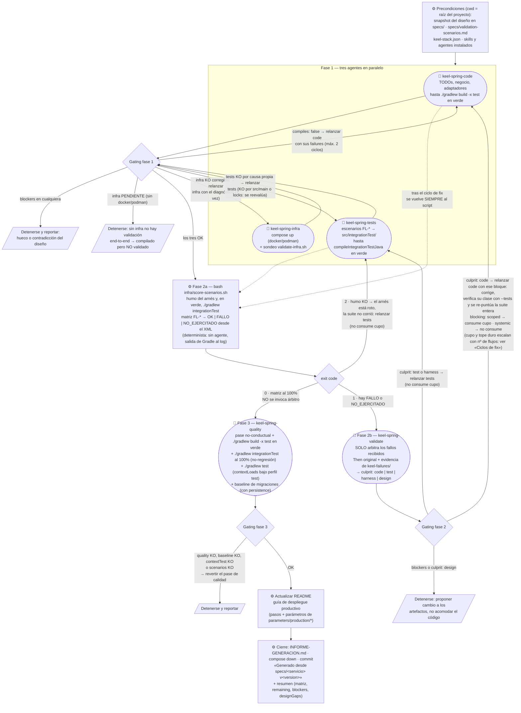

# Orquestación de agentes — cómo se genera el código

Cómo la skill `/keel-generate-spring` — ejecutada **dentro de este proyecto** (`cd` a la
raíz y `/keel-generate-spring`, sin argumentos) — lo completa hasta dejarlo funcional y
validado. La skill **no escribe código**: es la **orquestadora** de cinco subagentes
instalados como subagentes del proyecto, y toma sus decisiones de avance/relanzamiento (gating)
sobre el bloque estructurado (`status`, `blockers`, `failures`…) con el que cada agente
cierra su reporte.

No todo el gating necesita un agente. Lo que es **determinista** —ejecutar la suite y
derivar la matriz de escenarios del XML de JUnit— lo hace el orquestador con
`infra/score-scenarios.sh`, y el agente de arbitraje solo se invoca cuando esa matriz trae
algo en rojo. Una generación que sale limpia no gasta una sesión en decir «todo OK».

## Punto de partida: qué dejó hecho `build`

`keel-spring build`, ejecutado en el workspace de diseño, ya generó de forma
**determinista** todo lo transversal al stack: el proyecto compila y arranca, con dominio puro, puertos,
contratos CQRS + `UseCaseMediator`, controllers, JPA, seguridad, stubs con `// TODO`,
config por perfiles e infraestructura de prueba en `infra/`. Lo que queda para los
agentes es la **frontera dependiente de la infraestructura elegida** (publishers/listeners
del broker, adaptador de storage), la lógica de negocio con sus invariantes y la
validación funcional contra el servidor real.

> **Sin pruebas unitarias en este flujo; con pruebas de integración.** No es una
> contradicción: los escenarios `FL-*` de `validation-scenarios.md` se traducen **una vez**
> a pruebas de integración JUnit (`src/integrationTest/`, caja negra contra el contrato) y
> se ejecutan contra la infraestructura real. El criterio de "generación terminada" es
> `./gradlew build -x test` en verde + `./gradlew integrationTest` con el **100%** de los
> escenarios en OK. La suite de pruebas **unitarias** sigue siendo un proceso
> **independiente y posterior**, que arranca cuando el diseñador ha validado el
> funcionamiento del servidor; el andamiaje que deja `build` (deps, perfil `test` con H2,
> `<Nombre>ApplicationTests`) se conserva intacto para esa fase. La única excepción es
> `./gradlew test` en la fase 3: ahí esa suite es solo `contextLoads()`, y es lo único que
> comprueba que **todos los beans arrancan bajo el perfil `test`** —los escenarios corren
> con `@ActiveProfiles("local")` contra infraestructura real y no lo cubren—. No se
> escriben pruebas unitarias nuevas; solo se ejecuta la que `build` ya dejó.

## El pipeline

Dos tipos de nodo, y la diferencia es lo que hace legible dónde se gasta: los
**redondeados** son sesiones de agente (cuestan contexto y tiempo); los **rectos** con `⚙`
son deterministas — un script o una decisión del orquestador — y no cuestan nada. El camino
verde va del script directo a la fase 3 **sin invocar a ningún árbitro**.

```mermaid
flowchart TB
    PRE["⚙ Precondiciones (cwd = raíz del proyecto):<br/>snapshot del diseño en specs/ · specs/validation-scenarios.md<br/>keel-stack.json · skills y agentes instalados"]

    PRE --> F1
    subgraph F1["Fase 1 — tres agentes en paralelo"]
        CODE(["🤖 keel-spring-code<br/>TODOs, negocio, adaptadores<br/>hasta ./gradlew build -x test en verde"])
        INFRA(["🤖 keel-spring-infra<br/>compose up (docker/podman)<br/>+ sondeo validate-infra.sh"])
        TESTS(["🤖 keel-spring-tests<br/>escenarios FL-* → src/integrationTest/<br/>hasta compileIntegrationTestJava en verde"])
    end

    CODE --> GATE1{Gating fase 1}
    INFRA --> GATE1
    TESTS --> GATE1
    GATE1 -->|"compiles: false → relanzar code<br/>con sus failures (máx. 2 ciclos)"| CODE
    GATE1 -->|"infra KO corregible → relanzar<br/>infra con el diagnóstico (1 vez)"| INFRA
    GATE1 -->|"tests KO por causa propia → relanzar<br/>tests (KO por src/main o locks: se reevalúa)"| TESTS
    GATE1 -->|"blockers en cualquiera"| STOP1[/"Detenerse y reportar:<br/>hueco o contradicción del diseño"/]
    GATE1 -->|"infra PENDIENTE (sin docker/podman)"| STOP0[/"Detenerse: sin infra no hay validación<br/>end-to-end → compilado pero NO validado"/]
    GATE1 -->|los tres OK| SCORE

    SCORE["⚙ Fase 2a — bash infra/score-scenarios.sh<br/>humo del arnés y, en verde, ./gradlew integrationTest<br/>matriz FL-* → OK | FALLO | NO_EJERCITADO desde el XML<br/>(determinista: sin agente, salida de Gradle al log)"]
    SCORE --> GATE2A{exit code}
    GATE2A -->|"2 · humo KO → el arnés está roto,<br/>la suite no corrió: relanzar tests<br/>(no consume cupo)"| TESTS
    GATE2A -->|"0 · matriz al 100%<br/>NO se invoca árbitro"| QUALITY
    GATE2A -->|"1 · hay FALLO o NO_EJERCITADO"| VALIDATE

    VALIDATE(["🤖 Fase 2b — keel-spring-validate<br/>SOLO arbitra los fallos recibidos<br/>Then original + evidencia de keel-failures/<br/>→ culprit: code | test | harness | design"])
    VALIDATE --> GATE2{Gating fase 2}
    GATE2 -->|"culprit: code → relanzar code con ese bloque: corrige,<br/>verifica su clase con --tests y se re-puntúa la suite entera<br/>blocking: scoped → consume cupo · systemic → no consume<br/>(cupo y tope duro escalan con nº de flujos: ver «Ciclos de fix»)"| CODE
    GATE2 -->|"culprit: test o harness → relanzar tests<br/>(no consume cupo)"| TESTS
    GATE2 -->|"blockers o culprit: design"| STOP2[/"Detenerse: proponer cambio a los<br/>artefactos, no acomodar el código"/]

    CODE -.->|"tras el ciclo de fix<br/>se vuelve SIEMPRE al script"| SCORE
    TESTS -.-> SCORE

    QUALITY(["🤖 Fase 3 — keel-spring-quality<br/>pase no-conductual + ./gradlew build -x test en verde<br/>+ ./gradlew integrationTest al 100% (no-regresión)<br/>+ ./gradlew test (contextLoads bajo perfil test)<br/>+ baseline de migraciones (con persistence)"])
    QUALITY --> GATE3{Gating fase 3}
    GATE3 -->|"quality KO, baseline KO, contextTest KO<br/>o scenarios KO<br/>→ revertir el pase de calidad"| STOP3[/"Detenerse y reportar"/]
    GATE3 -->|OK| README["⚙ Actualizar README<br/>guía de despliegue productivo<br/>(pasos + parámetros de parameters/production/*)"]
    README --> CLOSE["⚙ Cierre: INFORME-GENERACION.md · compose down · commit<br/>«Generado desde specs/&lt;servicio&gt; v&lt;version&gt;»<br/>+ resumen (matriz, remaining, blockers, designGaps)"]
```

## Por qué la fase 2 está partida en dos

Ejecutar la suite y derivar «FL-x → OK | FALLO» del XML de JUnit **no requiere criterio**:
es parsear. Decidir de quién es la culpa de un fallo sí. Eran dos trabajos de naturaleza
distinta dentro del mismo agente, y separarlos tiene tres consecuencias:

- **Una generación en verde no cuesta ninguna sesión de agente.** Antes se pagaba una
  completa para que dijera «todo OK».
- **La matriz es determinista.** Sale siempre igual del mismo XML; un agente podía
  transcribirla mal.
- **El árbitro llega con el prompt pequeño**: recibe los fallos y su evidencia, no la
  ejecución entera.

Lo que **no** cambia: el arbitraje sigue fuera de `keel-spring-code`. Quien tiene que poner
la suite en verde no puede ser quien decide si la prueba que no pasa está mal — si lo fuera,
`culprit: test` sería su salida barata y el `Then` acabaría ajustándose al código en vez de
al revés.

**El script lo invoca el orquestador, y por eso su salida es compacta**: toda la salida de
Gradle va a `build/keel-scenarios/run.log` y por stdout solo sale la matriz. El orquestador
es la sesión más larga del pipeline (sobrevive las tres fases y todas las vueltas del bucle
de fix); volcarle miles de líneas de Gradle en cada vuelta lo dejaría compactado antes de
llegar a la fase 3. Ese ruido lo absorbía antes una sesión desechable, y la propiedad hay
que conservarla.

Antes del commit de cierre, con la re-validación en 100% OK, el orquestador actualiza la
sección `## Despliegue en producción` del `README.md` del proyecto: pasos para levantar el
servidor en production y la tabla de parámetros obligatorios, derivados de
`src/main/resources/parameters/production/*.yaml` (todo `${VAR}` sin default) y del stack, más
lo que los agentes cablearon al completar los adaptadores. El scaffolding deja un baseline
determinista de esa sección; el orquestador la reconcilia con el código final.

## Por qué la fase 1 son tres agentes y ninguno espera a otro

Los tres arrancan a la vez porque **todos sus insumos ya están en disco** antes de empezar:
los dejó `keel-spring build` (`specs/`, `docs/openapi.yaml`, `keel-stack.json`,
`parameters/local/security.yaml`, `infra/`). No hay arista entre ellos, ni de datos ni de
recursos:

- **`tests` no espera a `infra`.** Mientras las pruebas se *escriben* no se toca un
  contenedor: derivan del contrato y su gate es compilación pura. Serializar metería
  `compose up --build` y sus reintentos en el camino crítico a cambio de nada. Lo único que
  antes viajaba de infra a la validación era `authHint`; ahora los dos lados leen el mismo
  `infra/test-credentials.env` que genera `build`, así que no hay nada que negociar en
  ejecución: la infraestructura crea lo que ese archivo declara y `AbstractFlowIT` pide
  exactamente eso. Verificar la fontanería en vivo exige además el código terminado, así que
  no cabe en la fase 1 ni serializando: cae en la fase 2, donde el script arranca ejecutando
  el humo del arnés antes de la suite.
- **`tests` no espera a `code`, y no puede quedar preso de él.** `build.gradle` deja
  `src/main/java` fuera del `compileClasspath` del source set `integrationTest`, así que
  `compileIntegrationTestJava` compila con el `main` a medio escribir. Ese mismo hecho es lo
  que hace la caja negra estructural: un test que importe una clase generada no compila.
- **El paralelismo es la garantía de independencia**, no una optimización de agenda: el autor
  de las pruebas nunca ve el código terminado, así que el test no puede acomodarse a lo que el
  código hace en vez de a lo que el `Then` dice. Dos lecturas independientes del mismo spec
  que coinciden son evidencia; donde discrepan, sale un fallo que hay que arbitrar.

## Los cinco agentes

| Agente | Responsabilidad | Qué lee | Qué NO hace |
|---|---|---|---|
| `keel-spring-code` | Completa TODOs, lógica de negocio, invariantes y adaptadores del stack hasta `./gradlew build -x test` en verde. Antes de cada handler ejecuta la auditoría de [flow-fidelity](conventions/flow-fidelity.md). Relanzado desde la fase 2, lee la evidencia cruda de `build/keel-failures/` y cierra verificando su fix con `./gradlew integrationTest --tests '<ClaseAfectada>'`. | El archivo de contexto del proyecto (orden de capas), `architecture.md`, `constitution.md`, `specs/`, conventions ([mapping](conventions/mapping.md) estricto) y las skills `keel-spring-<tech>` del stack (SKILL.md primero, `references/` bajo demanda). | No escribe pruebas unitarias ni ejecuta `./gradlew test`; no toca contenedores ni ejecuta `bootRun`. En la fase 1 tampoco ejecuta escenarios; en el ciclo de fix ejecuta **solo** las clases que le señaló el arbitraje — y ejecutar `src/integrationTest/` nunca es editarlo. Su verde por clase no aprueba escenarios. |
| `keel-spring-infra` | Levanta `infra/docker-compose.yaml` con docker o podman (detección: `$CONTAINER_RUNTIME` → `docker` → `podman`), sondea con `infra/validate-infra.sh` (reintentos) y deja la infraestructura **arriba** para la validación. Con auth, **ejecuta y verifica** `infra/init-keycloak.sh` (que genera build) contra los valores de `infra/test-credentials.env`: no lo redacta. | [infra-validation](conventions/infra-validation.md) (sondeo por tecnología vía el contenedor `devtools`), la reference de auth del stack. | Nunca edita código del proyecto; solo corrige causas operativas (puerto ocupado, contenedor viejo). No baja la infraestructura al terminar. |
| `keel-spring-tests` | Traduce **una vez** los escenarios `FL-*` a pruebas de integración JUnit en `src/integrationTest/java/**/flows/` (una clase por flujo, `@DisplayName` con el id, `@BeforeAll` con `resetState()`), en caja negra: HTTP y JSON, jamás DTOs ni entidades. Cierra con `./gradlew compileIntegrationTestJava` en verde. | `specs/` (todas las capas + `validation-scenarios.md`), `docs/openapi.yaml`, [integration-tests](conventions/integration-tests.md) y la `AbstractFlowIT` que generó build. | **No lee `src/main/java`** (es la garantía de independencia), no implementa negocio, no escribe pruebas unitarias y no ejecuta las IT en la fase 1. |
| `keel-spring-validate` | **Árbitro**, y solo eso: recibe los escenarios que el script ya puntuó en FALLO y decide, contra el `Then` original y la evidencia de `build/keel-failures/`, si la culpa es `code \| test \| harness \| design`. **Se invoca solo si hay rojo**: con la matriz al 100% no corre. | `specs/validation-scenarios.md`, [integration-tests](conventions/integration-tests.md), [infra-validation](conventions/infra-validation.md) y los volcados de los fallos que recibe. | **No ejecuta la suite ni compone la matriz** (eso es del script: una pasada nueva sobrescribe los volcados). No corrige código ni escribe/edita tests; no siembra datos a mano; no baja la infraestructura. |
| `keel-spring-quality` | Pase de higiene **no-conductual** (imports, constructor injection, `final`, excepciones tipadas, código muerto) con `./gradlew build -x test` en verde; la no-regresión conductual la comprueba él mismo re-ejecutando `./gradlew integrationTest`. Con capa `persistence`, además el **baseline de migraciones**: exporta el DDL de las entidades ya finales (`infra/export-schema.sh`), lo revisa, lo commitea como `db/migration/V1__baseline_schema.sql` y lo prueba con `PROFILE=local,migrations` sobre una BD sin esquema. | [project-layout](conventions/project-layout.md), [mapping](conventions/mapping.md) (transaccionalidad), `keel-spring-database/references/migrations.md`. | Nada conductual: validaciones, firmas, status HTTP, eventos, `@Transactional` — se reportan en `remaining`, no se aplican. No relaja `ddl-auto` fuera de `local` ni usa `baseline-on-migrate` para forzar el arranque. |

Regla común: ningún agente pregunta al usuario — registra sus bloqueos en `blockers`
y termina; decide el orquestador. Y ningún hueco del diseño se resuelve en silencio
en el código: se propone como cambio a los artefactos (`designGaps`).

**La orquestación es de un solo nivel.** Los cinco son **hojas**: el único que invoca agentes
es la skill. No es una preferencia de estilo — es lo que sostiene el resto del contrato. El
cupo de ciclos se cuenta sobre las invocaciones del orquestador, así que un agente anidado no
entra en esa cuenta y el gate que debe parar una generación que no converge deja de verla; el
gating se decide sobre el bloque estructurado del agente invocado, así que un anidado hace que
el orquestador arbitre sobre trabajo que no puede atribuir; y las restricciones que hacen
válida la validación —el agente de pruebas sin leer `src/main/java`, el de código sin tocar
`src/integrationTest/`, el de calidad sin cambiar comportamiento— son **del agente**, no del
proceso: un subagente lanzado por él no las hereda. Lo garantiza el `tools:` de cada
su archivo de agente, que no les concede la herramienta de lanzar agentes; el frontmatter es el
candado y la regla escrita en cada agente, el porqué.

## Handoffs: qué campo consume quién

| Campo | Lo emite | Lo consume | Para qué |
|---|---|---|---|
| `compiles` / `failures` | `keel-spring-code` | Orquestador | Relanzar code con sus propios errores de compilación (máx. 2 ciclos en fase 1). |
| `status: PENDIENTE`, `runtime` | `keel-spring-infra` | Orquestador | Detener la orquestación sin docker/podman (no hay validación posible); elegir el runtime del `compose down` final. |
| `authHint` | `keel-spring-infra` | Orquestador | Solo si el proveedor **no** quedó con los valores de `infra/test-credentials.env` (el contrato que genera build y que lee `AbstractFlowIT`): entonces hay que pasar `AUTH_TOKEN_URL`/`AUTH_TEST_CLIENT`/`AUTH_CLIENT_SECRET` por entorno. |
| `identity` | `keel-spring-infra` | Orquestador, `keel-spring-validate` | Que el aprovisionamiento corrió y que el token se pidió **de verdad**. Sin `tokenChecked: OK`, todo escenario autenticado va a fallar en bloque y no por su contrato. |
| `classes` / `uncovered` | `keel-spring-tests` | Orquestador, resumen final | Qué flujos quedaron traducidos y qué escenarios **no** se ejercitan (y por qué): dejan de darse por probados en silencio. |
| `assumptions` | `keel-spring-tests` | `keel-spring-validate` | Apuestas sobre infraestructura que la fase 1 no puede verificar (nombre de cola, cliente M2M, secreto, bucket). La parte mecánica la cubre el humo del arnés que el script ejecuta antes de la suite; lo que quede sin cubrir y explique una tanda de fallos es un bloqueo `systemic`, no una colección de fallos de negocio. |
| matriz + `exit code` | ⚙ `infra/score-scenarios.sh` | Orquestador | La matriz `FL-* → OK \| FALLO \| NO_EJERCITADO`, determinista desde el XML. `0` → fase 3 sin invocar árbitro · `1` → invocar `keel-spring-validate` con los fallos · `2` → humo del arnés roto, la suite **no** se ejecutó: el ciclo es de arnés, no de negocio. |
| `failures[].culprit` | `keel-spring-validate` | Orquestador | A quién relanzar: `code` → `keel-spring-code`; `test` y `harness` → `keel-spring-tests`; `design` → detenerse. |
| `harnessPatches` | `keel-spring-tests` (relanzado) | Orquestador, `INFORME-GENERACION.md` | Parches al andamiaje generado (`AbstractFlowIT` y compañía). Van al informe de cierre para portarlos al generador: un defecto del arnés que se queda en el proyecto lo vuelve a pagar entero la siguiente generación. |
| `failures` (escenario, `evidence`, `class`, request, response, esperado) | `keel-spring-validate` | `keel-spring-code` / `keel-spring-tests` (relanzado) | Evidencia **exacta** para el ciclo de fix. `evidence` es la ruta del volcado de `build/keel-failures/`: el relanzado abre el JSON crudo —antes de ejecutar nada, porque una pasada nueva lo sobrescribe—, no el extracto. `class` le dice qué clase re-ejecutar para verificarse. |
| `verifiedClasses` | `keel-spring-code` (relanzado) | Orquestador, resumen | Qué clases quedaron verificadas en vivo antes de re-puntuar. Es señal de que el fix está listo para arbitrarse, **no** un escenario aprobado: la matriz la sigue componiendo el script con la suite completa. |
| `blocking: systemic \| scoped` | `keel-spring-validate` | Orquestador | Contar los ciclos de fix: ver «Ciclos de fix» abajo. |
| `coverageGaps` | `keel-spring-validate` | `keel-spring-tests` (relanzado), resumen | Categorías que ninguna clase de flujo ejercita: es cobertura que falta, no un fallo del código. |
| `remaining` | `keel-spring-quality` | Resumen final | Hallazgos conductuales pendientes de decisión humana, sin hueco de diseño detrás. |
| `probes[].verdict: FALSO-NEGATIVO` | `keel-spring-infra` | Orquestador, `INFORME-GENERACION.md` | Un check de `infra/validate-infra.sh` que falla con el efecto verificado en verde: el sondeo del generador está desalineado. No detiene nada (la infraestructura está sana), pero es un defecto del scaffold — se porta, no se parchea en el proyecto. |
| `baseline` | `keel-spring-quality` | Orquestador | Gate de desplegabilidad: `KO` → relanzar una vez con el error; sin `OK` el commit lo dice explícitamente (production no arrancaría). |
| `scenarios: OK \| KO` | `keel-spring-quality` | Orquestador | No-regresión: el pase de calidad no cambió comportamiento. `KO` → revertir el pase, no tocar las pruebas. |
| `contextTest: OK \| KO` | `keel-spring-quality` | Orquestador | `./gradlew test`: el contexto arranca bajo el perfil `test` (H2, sin infra, sin red). Cubre lo que los escenarios no ven, porque corren con `@ActiveProfiles("local")` contra infraestructura real: un adaptador que conecta al construirse o un bean que espera config que el perfil `test` no declara. `KO` → relanzar una vez con el error; sin `OK`, el commit lo dice. |
| `blockers` / `designGaps` | Cualquiera | Usuario | Contradicciones o huecos del diseño: se detiene la orquestación o se consolidan en el resumen; nunca se resuelven relanzando. |

## El ciclo de fix se verifica a sí mismo, pero no se aprueba a sí mismo

Un fix devuelto solo con `./gradlew build -x test` en verde no ha tocado un escenario: si
quedó a medias, descubrirlo cuesta una ejecución completa de la suite. Por eso el agente
relanzado en la fase 2 cierra ejecutando **las clases que le señaló el arbitraje**
(`--tests '<ClaseAfectada>'`), simétrico a lo que ya hacía `keel-spring-tests` tras un
`culprit: test`. Dos límites que hacen que esto no desdibuje el gate:

- **Verde por clase ≠ escenario aprobado.** Un fix puede regresionar un flujo que ese
  `--tests` no ejecuta, y la matriz se compone del XML de **una** ejecución completa. Tras
  cualquier ciclo de fix se vuelve **siempre** a `infra/score-scenarios.sh` con la suite
  entera; nunca se salta a la fase 3 por el verde del propio agente que corrigió.
- **Serialización obligatoria.** Es el único punto del pipeline donde dos agentes podrían
  invocar Gradle a la vez sobre el mismo directorio: si una tanda mezcla `culprit: code` y
  `culprit: test`/`harness`, se relanzan **en serie** (primero `code`, luego `tests`). No es solo
  contención de locks: `resetState()` vacía la base de datos en cada `@BeforeAll`, así que dos
  suites concurrentes se borran los datos entre sí y producen fallos que no son de nadie.

## Ciclos de fix: bloqueo sistémico ≠ fallos puntuales

El cupo de la fase 2 son los ciclos código→re-puntuación para **fallos puntuales**
(`blocking: scoped`), y **escala con el tamaño del diseño**: un servicio de 22
flujos y cinco piezas de infraestructura no cabe en el mismo presupuesto que uno
de cinco flujos. Se cuenta sobre los flujos `FL-*` de `specs/validation-scenarios.md`:

| Flujos `FL-*` | Ciclos `scoped` | Tope duro |
|---|---|---|
| hasta 10 | 2 | 4 |
| 11–20 | 3 | 5 |
| más de 20 | 4 | 6 |

Un ciclo que cerró un **bloqueo sistémico** (`blocking: systemic` — una causa
transversal única que impedía ejercitar casi cualquier escenario: seguridad,
arranque, infraestructura) **no consume cupo**.

Tampoco lo consume un ciclo con `culprit: test`: relanza a `keel-spring-tests`, no a
`keel-spring-code`, y corrige la **prueba**, no el servicio. Mismo argumento que exime a
los bloqueos sistémicos: el cupo mide cuántas veces se le da otra oportunidad al código, y
un test mal derivado no dice nada sobre el código.

Ni un ciclo con `culprit: harness` (o el humo del arnés en rojo): el defecto está en el
andamiaje que generó `build`, no en el servicio ni en la derivación de los escenarios. Dos
reglas propias, porque este es el ciclo que más caro sale cuando se gestiona mal:

- El relanzamiento **no se cierra con dos clases de muestra**. El agente hace `grep` del
  método corregido y ejecuta todas las clases que lo usan: un mismo archivo del arnés puede
  esconder dos causas distintas, y arreglar la primera sin barrer el resto significa pagar
  otra pasada completa para descubrir la segunda.
- Si el `culprit: harness` de una tanda apunta al mismo archivo que el de la tanda anterior,
  no se re-valida sin más: se exige esa verificación amplia **antes** de volver a la suite.

La razón es que un bloqueo sistémico *oculta* los fallos finos: mientras toda la
API responde 401, no se puede saber nada sobre las reglas de negocio. Al
destrabarlo aparece, por primera vez, una tanda de fallos específicos —
exactamente aquello para lo que existe el cupo. Cobrárselo al presupuesto de los
fallos puntuales lo agota antes de empezar a usarlo.

La verificación por clase del agente relanzado ocurre **dentro** del ciclo y no altera el
conteo: el cupo mide relanzamientos de `keel-spring-code`, no ejecuciones de Gradle.

El tope duro de la tabla acota el total de ciclos de fase 2 (los `scoped` más los
que cerraron bloqueos sistémicos), para que ninguna calificación deje la
orquestación en bucle. Alcanzado el límite que aplique, el orquestador reporta la
matriz y se detiene.

## El cierre devuelve al generador lo que es del generador

Parte de lo que aparece durante una generación **no es de este proyecto**: es un defecto o
un hueco del scaffold, reproducible en cualquier servicio con el mismo stack. Si se queda
en el resumen de una sesión, la siguiente generación lo vuelve a pagar entero — el
diagnóstico del arnés es de lo más caro del pipeline precisamente porque no hay
antecedentes.

Por eso el paso de cierre escribe `INFORME-GENERACION.md` en la raíz del proyecto, además
del resumen en pantalla. No es un registro de trabajo ya resuelto: es la entrada para
quien mantiene `keel-spring`. Va estructurado así:

1. **Incidencias**, una por sección, cada una con síntoma, causa, **por qué es del
   generador y no de este proyecto** (o lo contrario, dicho explícitamente), fix aplicado y
   recomendación. Fuentes: `harnessPatches`, los `probes[].verdict: FALSO-NEGATIVO` de
   infra, y los `failures` cuyo `culprit` fue `harness`.
2. **Código determinístico mejorable**: tabla área → archivo (como **patrón**, no como ruta
   de este proyecto) → cambio sugerido. Lo que un cambio en `keel-spring build` evitaría
   repetir sin intervención de ningún agente.
3. **Agentes y skills**: dónde un ciclo de diagnóstico fue largo por falta de un
   antecedente documentado, y qué frase en qué skill lo habría acortado. Un `culprit` mal
   atribuido o una tanda de fallos con una sola causa raíz son las señales.
4. **Huecos del diseño**: los `designGaps` consolidados de los cinco agentes, con el
   artefacto y la propuesta concreta. Son del **diseñador**, no del generador.

Regla de oro del informe: cada entrada dice de quién es. Un hallazgo sin dueño no acciona
nada, y una incidencia de este proyecto disfrazada de defecto del generador cuesta una
investigación inútil aguas arriba.

## Autosuficiencia del proyecto generado

`build` deja en este proyecto todo lo que el pipeline necesita: la skill orquestadora
(`keel-generate-spring`), los cinco agentes, las
conventions (`{{keel:docs}}/conventions/`), `architecture.md` y `constitution.md`, las skills por
tecnología del stack elegido y un snapshot del diseño en `specs/`. **No hay nada del
generador en el workspace de diseño**: el pipeline se ejecuta siempre con el cwd en esta
raíz, y funciona idéntico desde un clon del repo, sin el workspace.

El canónico del diseño sigue siendo `specs/<servicio>/` del workspace: el snapshot de
`specs/` se refresca en cada `keel-spring build`. Si el diseño cambió, se re-ejecuta
`keel-spring build specs/<servicio>` allí (solo añade archivos nuevos; con `--force`
sobrescribe) y se vuelve a entrar aquí.
